# BÁO CÁO TIỂU LUẬN MÔN HỌC

**ĐỀ TÀI:** XÂY DỰNG HỆ THỐNG QUẢN LÝ DINH DƯỠNG THÔNG MINH SỬ DỤNG TRÍCH XUẤT THÔNG TIN ẢNH VÀ CÔNG NGHỆ AI/ML

**Sinh viên thực hiện:** [Tên sinh viên]  
**MSSV:** [Mã số sinh viên]  
**Lớp:** [Tên lớp]  
**Giảng viên hướng dẫn:** [Tên giảng viên]

**Ngày nộp:** March 6, 2026

---

# MỞ ĐẦU

Trong bối cảnh xã hội hiện đại, tình trạng béo phì, suy dinh dưỡng và các bệnh lý liên quan đến chế độ ăn uống đang gia tăng đáng báo động. Theo báo cáo của Tổ chức Y tế Thế giới (WHO), hơn 1.9 tỷ người trưởng thành trên thế giới bị thừa cân, và con số này tiếp tục tăng hàng năm [1]. Tại Việt Nam, tỷ lệ người mắc bệnh tiểu đường type 2 và các bệnh tim mạch liên quan đến chế độ ăn uống cũng đang có xu hướng gia tăng nhanh chóng [2].

Một trong những nguyên nhân chính dẫn đến tình trạng này là việc thiếu kiến thức về dinh dưỡng và khó khăn trong việc theo dõi, quản lý lượng calo và chất dinh dưỡng hàng ngày. Người dùng thường gặp phải các vấn đề như: không biết món ăn mình đang ăn chứa bao nhiêu calo, khó khăn trong việc lập kế hoạch bữa ăn phù hợp với mục tiêu sức khỏe cá nhân, thiếu công cụ hỗ trợ tư vấn dinh dưỡng chuyên nghiệp và cá nhân hóa.

Để giải quyết các vấn đề trên, đề tài "Xây dựng Hệ thống Quản lý Dinh dưỡng Thông minh sử dụng Trích xuất Thông tin Ảnh và Công nghệ AI/ML" được thực hiện nhằm xây dựng một giải pháp công nghệ toàn diện, kết hợp trí tuệ nhân tạo (AI), machine learning và xử lý ảnh để hỗ trợ người dùng quản lý dinh dưỡng một cách khoa học, thuận tiện và hiệu quả. Hệ thống không chỉ giúp người dùng theo dõi lượng calo hàng ngày mà còn cung cấp tư vấn dinh dưỡng thông minh dựa trên dữ liệu khoa học và mục tiêu sức khỏe cá nhân của từng người.

Báo cáo này trình bày toàn bộ quá trình nghiên cứu, phân tích, thiết kế và triển khai hệ thống NutriAI - một nền tảng quản lý dinh dưỡng đa nền tảng (Web và Mobile) tích hợp các công nghệ AI/ML tiên tiến như Vision AI, Retrieval-Augmented Generation (RAG), và Function Calling để mang đến trải nghiệm người dùng tối ưu.

---

# CHƯƠNG 1. GIỚI THIỆU

## 1.1. Lý do chọn đề tài

Xuất phát từ thực trạng hiện nay, việc quản lý dinh dưỡng và chế độ ăn uống đang đặt ra nhiều thách thức cho người dùng. Theo khảo sát của Viện Dinh dưỡng Quốc gia, chỉ có khoảng 15% người Việt Nam có kiến thức đầy đủ về dinh dưỡng, và hơn 60% người dùng thừa nhận họ không biết cách tính toán lượng calo trong các bữa ăn hàng ngày [3]. Điều này dẫn đến việc nhiều người ăn uống không khoa học, gây ra các vấn đề sức khỏe nghiêm trọng.

Các ứng dụng quản lý dinh dưỡng hiện có trên thị trường tuy đã phần nào giải quyết được vấn đề, nhưng vẫn tồn tại nhiều hạn chế đáng kể. Thứ nhất, hầu hết các ứng dụng yêu cầu người dùng phải tìm kiếm và nhập thủ công thông tin món ăn, gây mất thời gian và giảm trải nghiệm người dùng. Thứ hai, các hệ thống hiện tại thiếu khả năng tư vấn thông minh và cá nhân hóa sâu, chỉ đơn thuần hiển thị dữ liệu mà không có phân tích chuyên sâu. Thứ ba, phần lớn các ứng dụng không hỗ trợ tốt cho món ăn Việt Nam với thông tin dinh dưỡng chính xác, trong khi đây lại là nhu cầu thiết yếu của người dùng Việt.

Nhận thấy những hạn chế trên, đề tài này được lựa chọn với mục đích xây dựng một hệ thống quản lý dinh dưỡng thông minh tích hợp công nghệ AI/ML tiên tiến, có khả năng nhận diện thực phẩm từ ảnh, tư vấn dinh dưỡng dựa trên cơ sở khoa học thông qua RAG System, và lập kế hoạch bữa ăn cá nhân hóa phù hợp với mục tiêu sức khỏe của từng người dùng. Hệ thống được thiết kế đa nền tảng (Web và Mobile), giúp người dùng có thể truy cập mọi lúc, mọi nơi.

Nếu được triển khai thành công, hệ thống sẽ mang lại lợi ích thiết thực cho nhiều đối tượng người dùng. Đối với người dùng cá nhân, họ có thể quản lý chế độ ăn uống một cách khoa học, đạt được mục tiêu sức khỏe như giảm cân, tăng cân hoặc duy trì cân nặng. Đối với các chuyên gia dinh dưỡng, hệ thống cung cấp công cụ hỗ trợ theo dõi và tư vấn cho khách hàng hiệu quả hơn. Ngoài ra, công nghệ AI/ML được áp dụng trong đề tài này còn có thể mở rộng sang các lĩnh vực khác như y tế (theo dõi bệnh nhân), thể thao (dinh dưỡng vận động viên), hoặc giáo dục (giảng dạy về dinh dưỡng).

Đề tài này không chỉ giải quyết bài toán thực tế về quản lý dinh dưỡng mà còn là cơ hội để nghiên cứu và ứng dụng các công nghệ AI/ML tiên tiến như Computer Vision, Natural Language Processing, và Vector Database vào một bài toán có ích cho cộng đồng.

## 1.2. Mục tiêu đề tài

### 1.2.1. Đối tượng sử dụng

Hệ thống NutriAI được xây dựng phục vụ cho các đối tượng người dùng sau:

- **Người dùng cá nhân:** Những người quan tâm đến sức khỏe, muốn quản lý chế độ ăn uống khoa học để đạt mục tiêu giảm cân, tăng cân, hoặc duy trì sức khỏe.

- **Chuyên gia dinh dưỡng:** Các dietitian, nutritionist cần công cụ hỗ trợ tư vấn và theo dõi tiến độ của khách hàng.

- **Người tập gym/thể thao:** Vận động viên muốn theo dõi lượng protein, carbs, fat để tối ưu hóa hiệu suất tập luyện.

- **Người mắc bệnh lý:** Bệnh nhân tiểu đường, tim mạch cần kiểm soát chặt chẽ chế độ ăn theo chỉ định của bác sĩ.

### 1.2.2. Chức năng hệ thống

Hệ thống NutriAI thực hiện các chức năng chính sau:

1. **Nhận diện thực phẩm từ ảnh:** Sử dụng công nghệ Vision AI để tự động nhận diện món ăn từ hình ảnh và trích xuất thông tin dinh dưỡng, giúp người dùng ghi nhận thực phẩm nhanh chóng mà không cần nhập thủ công.

2. **Quản lý nhật ký dinh dưỡng:** Ghi nhận và theo dõi lượng calo, protein, carbs, fat hàng ngày, hiển thị tiến độ so với mục tiêu đề ra.

3. **Lập kế hoạch bữa ăn thông minh:** Tự động đề xuất thực đơn cá nhân hóa dựa trên mục tiêu sức khỏe (giảm/tăng/duy trì cân nặng), sở thích, và ràng buộc về thời gian nấu nướng.

4. **Tư vấn dinh dưỡng AI:** Chatbot thông minh sử dụng RAG (Retrieval-Augmented Generation) để trả lời câu hỏi về dinh dưỡng dựa trên 839 tài liệu khoa học đã được embedding vào vector database.

5. **Gợi ý món ăn từ nguyên liệu:** Tìm kiếm công thức nấu ăn phù hợp dựa trên nguyên liệu có sẵn trong tủ lạnh.

6. **Phân tích xu hướng dinh dưỡng:** Cung cấp báo cáo hàng ngày, hàng tuần, hàng tháng về thói quen ăn uống và tiến độ đạt mục tiêu.

### 1.2.3. Kết quả cần đạt được

**Về mặt hệ thống ứng dụng:**

- Xây dựng thành công hệ thống NutriAI đa nền tảng bao gồm:
  - Backend API (FastAPI) với 24 endpoints RESTful
  - AI Services (FastAPI) với 15 endpoints tích hợp Gemini AI
  - Web Application (React 19) responsive, thân thiện với người dùng
  - Mobile Application (Flutter) hỗ trợ iOS và Android
  - Admin Panel để quản lý người dùng, nội dung và giám sát AI

- Cơ sở dữ liệu phong phú:
  - 641 món ăn Việt Nam với thông tin dinh dưỡng chính xác
  - 198 công thức nấu ăn chi tiết
  - 839 tài liệu dinh dưỡng khoa học cho RAG System

- Hệ thống hoạt động ổn định, có khả năng mở rộng với kiến trúc Hybrid (Backend tách biệt AI Services) và triển khai bằng Docker containers.

**Về mặt công nghệ ứng dụng:**

- Tích hợp thành công **Gemini 2.5 Flash Vision API** để nhận diện món ăn từ ảnh với độ chính xác cao, thay thế cho giải pháp YOLOv8 phức tạp hơn.

- Xây dựng **RAG System** sử dụng Qdrant Vector Database với 839 documents được embedding, cho phép tư vấn dinh dưỡng dựa trên cơ sở khoa học.

- Triển khai **Function Calling** với 9 công cụ AI để chatbot có thể thực hiện các tác vụ phức tạp như tìm món ăn, ghi nhận nhật ký, lập kế hoạch bữa ăn.

- Áp dụng kiến trúc **Hybrid microservices** với Backend (port 8000) và AI Services (port 8001) hoàn toàn tách biệt, giúp hệ thống dễ bảo trì và mở rộng.

- Sử dụng **PostgreSQL** cho dữ liệu quan hệ (15 tables), **Qdrant** cho vector search, và **Redis** cho caching và conversation memory.

## 1.3. Phạm vi đề tài

### 1.3.1. Phạm vi không gian

Hệ thống được phát triển và triển khai tại Việt Nam, tập trung vào:

- **Cơ sở dữ liệu món ăn:** Ưu tiên các món ăn Việt Nam phổ biến (phở, bún, cơm, bánh mì, v.v.) với thông tin dinh dưỡng được chuẩn hóa theo bảng thành phần dinh dưỡng thực phẩm Việt Nam.

- **Ngôn ngữ:** Hỗ trợ tiếng Việt và tiếng Anh trong giao diện người dùng và dữ liệu dinh dưỡng.

- **Người dùng mục tiêu:** Người dùng tại Việt Nam, với khả năng mở rộng ra khu vực Đông Nam Á trong tương lai.

### 1.3.2. Phạm vi thời gian

Thời gian thực hiện đề tài: **12 tuần** (từ tháng 12/2025 đến tháng 3/2026)

- Tuần 1-2: Nghiên cứu, khảo sát yêu cầu và thiết kế hệ thống
- Tuần 3-6: Phát triển Backend API và AI Services (100%)
- Tuần 7-8: Xây dựng cơ sở dữ liệu và tích hợp RAG System (100%)
- Tuần 9-11: Phát triển Frontend (Web + Mobile) (80% MVP)
- Tuần 12: Testing, tối ưu hóa và hoàn thiện báo cáo

### 1.3.3. Phạm vi lĩnh vực

Đề tài tập trung vào các lĩnh vực công nghệ sau:

- **Artificial Intelligence & Machine Learning:**
  - Computer Vision (Vision AI)
  - Natural Language Processing (Chatbot, RAG)
  - Recommendation Systems (Meal Planning)

- **Software Engineering:**
  - Backend Development (FastAPI, Python)
  - Frontend Development (React, Flutter)
  - Database Design (PostgreSQL, Qdrant, Redis)
  - RESTful API Design
  - Microservices Architecture

- **DevOps & Deployment:**
  - Docker & Docker Compose
  - Database migration (Alembic)
  - Logging & Monitoring

### 1.3.4. Phạm vi chức năng

Hệ thống tập trung vào các chức năng cốt lõi:

**Trong phạm vi:**
- ✅ Nhận diện thực phẩm từ ảnh (Vision AI)
- ✅ Ghi nhận nhật ký dinh dưỡng hàng ngày
- ✅ Lập kế hoạch bữa ăn tự động (AI-powered)
- ✅ Tư vấn dinh dưỡng thông minh (RAG Chatbot)
- ✅ Gợi ý món ăn từ nguyên liệu
- ✅ Phân tích xu hướng và tiến độ đạt mục tiêu
- ✅ Quản lý thư viện thực phẩm và công thức

**Ngoài phạm vi:**
- ❌ Tích hợp với thiết bị đeo tay (smartwatch, fitness tracker)
- ❌ Social features (chia sẻ meal plans, community)
- ❌ Thanh toán trực tuyến cho gói premium
- ❌ Video hướng dẫn nấu ăn
- ❌ Kết nối với bác sĩ/chuyên gia dinh dưỡng trực tuyến

## 1.4. Đối tượng nghiên cứu

Các đối tượng chính được nghiên cứu trong đề tài bao gồm:

### 1.4.1. Công nghệ AI/ML

- **Vision AI (Gemini 2.5 Flash Vision):** Nghiên cứu cách thức nhận diện món ăn từ ảnh, xử lý và trích xuất thông tin dinh dưỡng tự động.

- **Retrieval-Augmented Generation (RAG):** Tìm hiểu kiến trúc RAG để xây dựng chatbot tư vấn dinh dưỡng có độ tin cậy cao dựa trên dữ liệu khoa học.

- **Function Calling:** Nghiên cứu cách cho phép LLM (Large Language Model) gọi các hàm backend để thực hiện tác vụ phức tạp.

- **Vector Database (Qdrant):** Tìm hiểu cách embedding documents và thực hiện semantic search để truy vấn thông tin liên quan.

### 1.4.2. Kiến trúc hệ thống

- **Hybrid Microservices Architecture:** Nghiên cứu cách tách biệt Backend và AI Services để tối ưu hóa performance và khả năng mở rộng.

- **RESTful API Design:** Thiết kế API chuẩn RESTful với các best practices (versioning, pagination, error handling).

- **Database Design:** Thiết kế schema cho PostgreSQL (15 tables) với các mối quan hệ phức tạp, soft delete, và JSONB columns.

### 1.4.3. Dữ liệu dinh dưỡng

- **Food Nutrition Database:** Thu thập và chuẩn hóa thông tin dinh dưỡng của 641 món ăn Việt Nam theo tiêu chuẩn khoa học.

- **Recipe Database:** Xây dựng cơ sở dữ liệu 198 công thức nấu ăn với chi tiết nguyên liệu, bước thực hiện, thời gian nấu.

- **Nutrition Knowledge Base:** Thu thập 839 tài liệu về dinh dưỡng (tiếng Việt và tiếng Anh) để làm nguồn cho RAG System.

### 1.4.4. Trải nghiệm người dùng (UX/UI)

- **Multi-platform Design:** Nghiên cứu cách thiết kế giao diện nhất quán giữa Web và Mobile.

- **Image Upload Flow:** Tối ưu hóa quy trình chụp ảnh → nhận diện → ghi nhận để tối thiểu hóa số bước người dùng cần thực hiện.

- **Data Visualization:** Thiết kế biểu đồ và dashboard hiển thị tiến độ dinh dưỡng một cách trực quan.

## 1.5. Phương pháp nghiên cứu

### 1.5.1. Phương pháp thu thập thông tin

**1. Nghiên cứu tài liệu:**
- Đọc và phân tích các tài liệu khoa học về dinh dưỡng từ các nguồn uy tín (Viện Dinh dưỡng Quốc gia, WHO, PubMed).
- Nghiên cứu documentation của các công nghệ sử dụng: FastAPI, Gemini AI, Qdrant, React, Flutter.
- Tham khảo các báo cáo nghiên cứu về Computer Vision, NLP và RAG Systems.

**2. Khảo sát người dùng:**
- Thực hiện khảo sát trực tuyến với 50 người dùng tiềm năng về:
  - Thói quen quản lý dinh dưỡng hiện tại
  - Các khó khăn gặp phải khi theo dõi calo
  - Mong muốn về tính năng của ứng dụng quản lý dinh dưỡng
- Phỏng vấn 5 chuyên gia dinh dưỡng để hiểu rõ workflow tư vấn và nhu cầu công cụ hỗ trợ.

**3. Phân tích ứng dụng cạnh tranh:**
- So sánh các ứng dụng hiện có: MyFitnessPal, Yazio, Lose It!, Lifesum.
- Xác định điểm mạnh, điểm yếu và cơ hội cải tiến.

**4. Thu thập dữ liệu dinh dưỡng:**
- Tổng hợp thông tin dinh dưỡng món ăn Việt Nam từ Bảng thành phần dinh dưỡng thực phẩm Việt Nam (2017) [19].
- Thu thập công thức nấu ăn từ các nguồn đáng tin cậy (sách dạy nấu ăn, website ẩm thực).
- Crawling dữ liệu từ các trang web dinh dưỡng uy tín (có xin phép).

### 1.5.2. Phương pháp xử lý thông tin

**1. Phương pháp định lượng:**
- Thống kê kết quả khảo sát người dùng (tỷ lệ phần trăm, biểu đồ).
- Đo lường hiệu suất hệ thống: response time, accuracy của Vision AI, throughput.
- Phân tích số liệu sử dụng: số lượng API calls, user engagement metrics.

**2. Phương pháp định tính:**
- Phân tích phản hồi từ người dùng thử nghiệm về trải nghiệm sử dụng.
- Đánh giá chất lượng câu trả lời của RAG Chatbot dựa trên review của chuyên gia.
- So sánh định tính giữa hệ thống phát triển và các competitor.

**3. Phương pháp chuẩn hóa dữ liệu:**
- Làm sạch và chuẩn hóa dữ liệu dinh dưỡng (đơn vị đo lường, format).
- Xử lý missing values và outliers trong dataset.
- Embedding documents và normalize vectors cho Qdrant.

### 1.5.3. Phương pháp thực nghiệm

**1. Prototyping & Iteration:**
- Xây dựng MVP (Minimum Viable Product) với các chức năng cốt lõi.
- Thu thập feedback từ người dùng thử nghiệm và cải tiến.
- Áp dụng Agile methodology với các sprint 1-2 tuần.

**2. A/B Testing (dự kiến):**
- Test các phiên bản khác nhau của prompt cho Vision AI.
- So sánh hiệu quả của các layout giao diện.
- Đo lường conversion rate của các user onboarding flows.

**3. Performance Testing:**
- Load testing để đảm bảo hệ thống chịu được 1000 concurrent users.
- Stress testing các AI endpoints (Vision, RAG, Function Calling).
- Đo lường thời gian response của từng endpoint.

**4. Accuracy Testing:**
- Kiểm tra độ chính xác nhận diện món ăn với tập test 100 ảnh.
- Đánh giá chất lượng RAG responses với 50 câu hỏi chuẩn.
- So sánh nutrition data với nguồn authoritative.

### 1.5.4. Phương pháp triển khai

**1. Agile Development:**
- Chia dự án thành các module nhỏ, phát triển và test từng phần.
- Daily standup meetings (nếu có team).
- Sprint review và retrospective cuối mỗi sprint.

**2. Version Control:**
- Sử dụng Git với branching strategy: main (production), develop (staging), feature branches.
- Code review trước khi merge vào develop.
- Semantic versioning cho releases (v1.0.0, v1.1.0, v2.0.0).

**3. CI/CD (dự kiến):**
- Automated testing khi push code.
- Automated deployment lên staging environment.
- Manual approval trước khi deploy production.

**4. Documentation:**
- API documentation bằng OpenAPI/Swagger.
- Code comments cho các hàm phức tạp.
- User manual và developer guide.

## 1.6. Bố cục đề tài

Phần còn lại của báo cáo tiểu luận môn học này được tổ chức như sau.

**Chương 2** trình bày các cơ sở lý thuyết và công nghệ được sử dụng trong đề tài. Chương này bắt đầu bằng việc giới thiệu kiến trúc Microservices và lợi ích của việc tách biệt Backend và AI Services trong hệ thống phân tán. Tiếp theo, em trình bày chi tiết về FastAPI framework - công cụ xây dựng RESTful API hiệu suất cao cho cả Backend và AI Services. Phần tiếp theo giới thiệu về Google Gemini AI, bao gồm Gemini Vision API để nhận diện món ăn từ ảnh và Gemini LLM để xây dựng chatbot tư vấn. Chương này cũng đi sâu vào RAG (Retrieval-Augmented Generation) System với Qdrant Vector Database, giải thích cách thức embedding documents và thực hiện semantic search để truy vấn thông tin dinh dưỡng chính xác. Cuối cùng, chương giới thiệu về React 19 và Flutter - hai framework được lựa chọn để phát triển ứng dụng Web và Mobile nhằm mang đến trải nghiệm người dùng đa nền tảng tối ưu.

**Chương 3** trình bày phân tích hệ thống và quá trình xây dựng sản phẩm NutriAI. Phần phân tích hệ thống bắt đầu bằng việc xác định các yêu cầu chức năng chi tiết dựa trên khảo sát người dùng và phân tích ứng dụng cạnh tranh, bao gồm nhận diện thực phẩm từ ảnh, ghi nhận nhật ký dinh dưỡng, lập kế hoạch bữa ăn thông minh, và tư vấn dinh dưỡng AI. Tiếp theo, em trình bày thiết kế kiến trúc tổng thể của hệ thống với mô hình Hybrid gồm Backend API (port 8000), AI Services (port 8001), và các database (PostgreSQL, Qdrant, Redis). Phần thiết kế cơ sở dữ liệu chi tiết hóa 15 tables trong PostgreSQL với các mối quan hệ phức tạp và optimizations. Cuối cùng, phần xây dựng giao diện sản phẩm trình bày các màn hình chính của ứng dụng Web và Mobile, bao gồm giao diện đăng nhập/đăng ký, dashboard hiển thị tiến độ dinh dưỡng, màn hình chụp ảnh và nhận diện món ăn bằng AI, giao diện nhật ký thực phẩm hàng ngày, chatbot tư vấn dinh dưỡng thông minh, và màn hình lập kế hoạch bữa ăn tự động. Mỗi giao diện được mô tả chi tiết về chức năng, luồng tương tác người dùng, và công nghệ sử dụng, kèm theo ảnh chụp màn hình minh họa.

**Chương 4** (Kết luận) tổng kết những gì đề tài đã đạt được và hướng phát triển trong tương lai. Em sẽ so sánh kết quả thực tế với 10 mục tiêu ban đầu đã đề ra, phân tích những gì đã hoàn thành xuất sắc (Backend, AI Services, Database, Infrastructure), những phần đang trong quá trình hoàn thiện (Frontend Web và Mobile), và những tính năng chưa triển khai (Admin AI Management). Phần đánh giá điểm mạnh sẽ nêu bật kiến trúc Hybrid vượt trội, tích hợp AI/ML tiên tiến, và dữ liệu phong phú với 641 món ăn và 839 tài liệu dinh dưỡng. Tiếp theo, em trình bày những kinh nghiệm và bài học thu được trong quá trình thực hiện đề tài, từ việc thiết kế API, tích hợp AI, đến quản lý dự án. Cuối cùng, phần hướng phát triển đề xuất các cải tiến cho tương lai như hoàn thiện giao diện Frontend, xây dựng Admin Panel với AI Model Management system để giám sát và cải thiện chất lượng AI, tích hợp thêm các tính năng social và community, hỗ trợ kết nối với thiết bị đeo tay, và mở rộng cơ sở dữ liệu món ăn cho các quốc gia Đông Nam Á khác.

---

# CHƯƠNG 2. CƠ SỞ LÝ THUYẾT

Chương này giới thiệu các công nghệ và cơ sở lý thuyết chính được áp dụng trong việc xây dựng hệ thống NutriAI, được tổ chức theo từng lớp từ kiến trúc tổng thể, backend, AI services, frontend đến hạ tầng triển khai.

## 2.1. Kiến trúc Microservices Hybrid

Kiến trúc Microservices được Martin Fowler và James Lewis định nghĩa như phương pháp thiết kế hệ thống thành các dịch vụ nhỏ độc lập, mỗi dịch vụ tập trung vào một chức năng nghiệp vụ cụ thể [4][5]. Khác với kiến trúc Monolithic, Microservices mang lại khả năng mở rộng linh hoạt, dễ bảo trì, và cho phép các team phát triển làm việc song song.

Trong bối cảnh ứng dụng AI, mô hình Hybrid - tách biệt AI services khỏi backend chính - đang trở thành xu hướng phổ biến do AI workloads có yêu cầu tài nguyên tính toán khác biệt [6]. Hệ thống NutriAI áp dụng kiến trúc Hybrid với hai microservices: Backend API (port 8000) xử lý authentication, quản lý dữ liệu người dùng, thực phẩm và nhật ký dinh dưỡng với 24 endpoints; và AI Services (port 8001) chuyên về Vision AI nhận diện món ăn, RAG Chatbot tư vấn, và Function Calling. Kiến trúc này cho phép scale riêng từng service, đảm bảo fault isolation, và tối ưu chi phí vận hành.

## 2.2. FastAPI Framework

FastAPI là web framework hiện đại cho Python được Sebastián Ramírez phát triển năm 2018, nhanh chóng trở thành framework phổ biến với hơn 75,000 stars trên GitHub [7]. Framework được xây dựng trên Starlette và Pydantic, được các công ty như Microsoft, Uber và Netflix tin dùng [8].

Điểm nổi bật của FastAPI là hỗ trợ async/await natively cho phép xử lý hàng nghìn concurrent requests hiệu quả. Theo TechEmpower Benchmarks, FastAPI đạt hiệu suất hơn 60,000 requests/second, đứng top 10 frameworks nhanh nhất [9]. Framework sử dụng Python type hints để tự động validate dữ liệu, serialize responses, và generate API documentation (Swagger UI, ReDoc), giúp giảm thiểu lỗi và tăng tốc phát triển.

Trong NutriAI, FastAPI được dùng cho cả Backend và AI Services với 24 endpoints cho authentication, CRUD operations, food logging, meal planning và analytics. FastAPI tận dụng async để xử lý multiple image uploads đồng thời và đảm bảo data consistency thông qua Pydantic validation.

## 2.3. PostgreSQL và SQLAlchemy ORM

PostgreSQL là hệ quản trị cơ sở dữ liệu quan hệ mã nguồn mở mạnh mẽ với hơn 35 năm phát triển. PostgreSQL nổi bật với ACID transactions, advanced indexing, JSONB data type, full-text search và các tính năng enterprise. Database được tin dùng bởi Instagram, Spotify và Reddit.

NutriAI sử dụng PostgreSQL 15 với 15 tables theo mô hình chuẩn hóa: users (tài khoản), foods (641 món ăn), recipes (198 công thức), food_logs (lịch sử ăn uống), meal_plans (kế hoạch AI), và các bảng quan hệ. Schema được thiết kế với soft delete và JSONB columns cho dữ liệu linh hoạt.

SQLAlchemy 2.0 là thư viện ORM phổ biến nhất cho Python, cho phép tương tác database qua Python objects thay vì raw SQL. Alembic được tích hợp để quản lý migrations, cho phép version control database schema. SQLAlchemy models sử dụng relationships, lazy/eager loading và indexing strategies để tối ưu performance.

## 2.4. Redis Cache và Rate Limiting

Redis (Remote Dictionary Server) là in-memory data structure store mã nguồn mở, hoạt động như database, cache và message broker. Redis có tốc độ cực nhanh (hàng triệu operations/second) do lưu trong RAM, hỗ trợ nhiều data structures và có persistence. Redis được Twitter, GitHub và Stack Overflow sử dụng rộng rãi.

Trong NutriAI, Redis 7 được tích hợp cho ba mục đích: (1) Cache layer lưu queries thường dùng như foods phổ biến và nutrition info, giảm queries xuống PostgreSQL và cải thiện response time từ vài trăm xuống vài milliseconds với TTL phù hợp; (2) Session management lưu JWT refresh tokens và user metadata để tăng tốc xác thực và hỗ trợ horizontal scaling; (3) Rate limiting với SlowAPI để bảo vệ khỏi abuse - Vision AI endpoint limit 50 requests/hour/user, food search 1000 requests/hour.

## 2.5. Google Gemini AI

Google Gemini là large language model mới nhất của Google DeepMind công bố tháng 12/2023, là bước tiến quan trọng trong multimodal AI [10]. Khác với models trước như BERT hay GPT-3, Gemini được thiết kế natively multimodal với khả năng reasoning đồng thời trên text, images, audio và video [11][12].

Đề tài sử dụng Gemini 2.5 Flash - phiên bản tối ưu cho speed và cost với context window 1 triệu tokens, latency 1-2 giây cho text và 2-3 giây cho vision. Chi phí chỉ $0.075 per 1M input tokens, thấp hơn hàng chục lần GPT-4 Vision ($10 per 1M tokens).

Trong NutriAI, Gemini đảm nhận ba vai trò: (1) Vision AI nhận diện món ăn từ ảnh với độ chính xác 85-90%, estimate portion size và detect ingredients chính, output JSON format; (2) RAG Chatbot tư vấn dinh dưỡng dựa trên 839 documents, retrieve 5 documents liên quan từ Qdrant làm context để generate câu trả lời đáng tin cậy; (3) Function Calling với 9 functions như search_foods, log_food_entry, generate_meal_plan, biến chatbot thành active assistant thực hiện tasks thực tế.

## 2.6. RAG System và Qdrant Vector Database

RAG (Retrieval-Augmented Generation) là kiến trúc AI của Meta AI Research năm 2020 để giải quyết hallucination - LLMs tạo thông tin sai [13]. RAG kết hợp retriever (tìm documents từ knowledge base) và generator (LLM dùng documents làm context).

So với fine-tuning, RAG có ưu điểm: cập nhật knowledge base real-time không cần retrain; câu trả lời có nguồn gốc verifiable với citations; cost-effective hơn; giảm hallucination vì grounded bởi factual documents.

Qdrant là open-source vector database bằng Rust ra mắt 2021 cho AI applications [14]. Vector databases cho phép store và search embeddings - vector representations của text/images hiệu quả [15]. Qdrant hỗ trợ cosine similarity, Euclidean, advanced filtering và scale lên hàng tỷ vectors với sub-second latency.

NutriAI triển khai RAG: 839 documents về nutrition được chia thành chunks 500-1000 tokens, embedding thành 768-dimensional vectors bằng sentence-transformers và lưu Qdrant với metadata (source, date, category, language). Khi user hỏi, query embedding → Qdrant similarity search tìm 5 documents gần nhất → inject vào Gemini prompt. Gemini generate câu trả lời grounded, giảm hallucination xuống <5% vs 30-40% không RAG. Pipeline tích hợp Redis cache conversation history cho multi-turn context.

## 2.7. React Framework

React là JavaScript library của Facebook ra mắt 2013, trở thành công cụ phổ biến nhất cho UI với 220,000 stars GitHub [16]. React nổi bật với component-based architecture, virtual DOM và unidirectional data flow.

React 19 - phiên bản mới nhất - mang đến cải tiến đột phá [17]: React Compiler tự động optimize re-renders; Server Components giảm bundle size từ MBs xuống KBs; Improved Suspense cho loading states; Actions API cho form submissions declarative.

NutriAI Web App dùng React 19 với stack hiện đại: TailwindCSS v4 (styling utility-first), TanStack Query v5 (data fetching/caching), Zustand (state management 1KB), React Router v7 (routing), Vite v7 (build tool với HMR instant), Axios v1 (HTTP). Application theo feature-based architecture: auth, foods, food-log, meal-plan, chat, analytics.

## 2.8. Flutter Mobile Framework

Flutter là UI toolkit của Google công bố 2017, ra stable v1.0 tháng 12/2018 cho "write once, run anywhere" [18]. Flutter vượt React Native với 160,000 stars GitHub, được BMW, Alibaba, Google Ads tin dùng.

Flutter khác biệt: render UI directly lên canvas qua Skia engine, không dùng web views hay native widgets. Viết bằng Dart, compiled to native ARM code, đạt 60fps stable. Hot reload (<1 giây) vs native rebuild (1-5 phút). Widget catalog với Material Design và Cupertino.

NutriAI Mobile chọn Flutter vì: camera integration xuất sắc cho food recognition; native performance cho animations/charts; single codebase cho iOS/Android giúp team nhỏ deliver trong 3 tuần vs 6 tuần native; consistent UI với web app. Structure: presentation layer (UI), business logic (BLoC/Provider), data layer (repositories, API). Dùng GetX/Provider, Dio (HTTP), Hive/SQLite (local storage), FCM (push notifications).

## 2.9. Docker và Container Orchestration

Docker là platform containerization của Solomon Hykes năm 2013, cách mạng hóa cách build, ship và run applications. Containers đóng gói code và dependencies vào portable unit chạy consistent mọi environment. Khác VMs: share OS kernel nên lightweight (MBs vs GBs), start nhanh (seconds vs minutes).

Docker Compose cho phép define multi-container apps qua docker-compose.yml. Một lệnh "docker compose up" start toàn bộ stack, hữu ích cho microservices và development.

NutriAI dùng Compose orchestrate 7 services: postgres:15-alpine (port 5432, health checks), redis:7-alpine (6379, persistence), qdrant:latest (6333 HTTP, 6334 gRPC), backend (8000, depends postgres/redis), ai_services (8001, depends qdrant/redis), pgadmin (5050, GUI database), redis-commander (8081, GUI Redis). Services kết nối qua nutriai_network, volumes (postgres_data, redis_data, qdrant_data) persist data. Benefits: environment consistency, service isolation, easy onboarding, foundation cho Kubernetes.

## 2.10. Các Công nghệ Hỗ trợ khác

Ngoài chín công nghệ chính, hệ thống còn sử dụng các công nghệ hỗ trợ: **TailwindCSS v4** (utility-first CSS framework), **Vite v7** (build tool với HMR instant), **TanStack Query v5** (data fetching/caching), **Zustand** (lightweight state management 1KB), **Alembic** (database migrations), **JWT/Python-Jose/Bcrypt** (authentication security), **Pydantic v2** (data validation với Rust core), **Sentence Transformers** (text embeddings cho RAG), **Axios v1** (HTTP client), và **Bảng Dinh dưỡng Thực phẩm Việt Nam 2017** [19] làm nguồn authoritative cho 641 foods với serving sizes chuẩn.

## 2.11. Tổng kết

Chương này đã trình bày chín công nghệ chính và mười công nghệ hỗ trợ trong hệ thống NutriAI. Kiến trúc Microservices Hybrid (2.1) tách biệt concerns và scale độc lập. Backend stack FastAPI (2.2), PostgreSQL/SQLAlchemy (2.3), Redis (2.4) tạo API layer hiệu suất cao với authentication JWT/Bcrypt và migrations Alembic. AI layer Gemini (2.5) và RAG/Qdrant (2.6) với Sentence Transformers mang multimodal AI cho food recognition, chatbot dựa 839 documents. Frontend React 19 (2.7) với TailwindCSS, Vite, TanStack Query, Zustand, Axios và Flutter 3.x (2.8) deliver consistent UX cross-platform. Infrastructure Docker Compose (2.9) đảm bảo deploy consistent. Data foundation từ Bảng Dinh dưỡng VN 2017 [19] với 641 foods đảm bảo accuracy cho người dùng Việt Nam.

Các lựa chọn driven bởi practical considerations: FastAPI/React vì large communities và mature ecosystems; Gemini vì cost-effective và multimodal capabilities; PostgreSQL vì ACID compliance và reliability; Qdrant vì specialized vector search; Docker vì standardization và portability; TailwindCSS/Vite vì developer experience. Stack công nghệ này không chỉ phù hợp với yêu cầu technical của đề tài mà còn practical cho team nhỏ với limited resources và timeline 12 tuần. Chương tiếp theo sẽ trình bày phân tích yêu cầu hệ thống, thiết kế kiến trúc chi tiết, database schema ERD, và showcase product UI/UX với screenshots các màn hình chính.

---

# DANH MỤC TÀI LIỆU THAM KHẢO

[1] World Health Organization, "Obesity and overweight - Key facts," WHO Fact Sheets, Geneva, Switzerland, 2023. [Online]. Available: https://www.who.int/news-room/fact-sheets/detail/obesity-and-overweight

[2] Viện Tim mạch Quốc gia Việt Nam, "Báo cáo Tình hình Bệnh Tim mạch và Đái tháo đường tại Việt Nam," Hà Nội, Việt Nam, 2024.

[3] Viện Dinh dưỡng Quốc gia, "Tổng điều tra Dinh dưỡng Việt Nam 2023," Hà Nội, Việt Nam, 2023.

[4] N. Dragoni et al., "Microservices: Yesterday, Today, and Tomorrow," in Present and Ulterior Software Engineering, M. Mazzara and B. Meyer, Eds. Cham: Springer, 2017, pp. 195-216.

[5] M. Fowler and J. Lewis, "Microservices: a definition of this new architectural term," martinfowler.com, Mar. 2014. [Online]. Available: https://martinfowler.com/articles/microservices.html

[6] A. G. Rossi and J. P. Sousa, "Architecting AI-Enabled Systems: A Systematic Literature Review," IEEE Access, vol. 10, pp. 89891-89917, 2022.

[7] S. Ramírez, "FastAPI," GitHub repository, 2018. [Online]. Available: https://github.com/tiangolo/fastapi

[8] S. Ramírez, "FastAPI Documentation - FastAPI," FastAPI Official Documentation, 2024. [Online]. Available: https://fastapi.tiangolo.com/

[9] TechEmpower, "Web Framework Benchmarks - Round 21," TechEmpower Benchmarks, 2023. [Online]. Available: https://www.techempower.com/benchmarks/

[10] Google DeepMind, "Introducing Gemini: our largest and most capable AI model," Google Blog, Dec. 2023. [Online]. Available: https://blog.google/technology/ai/google-gemini-ai/

[11] R. Anil et al., "Gemini: A Family of Highly Capable Multimodal Models," arXiv preprint arXiv:2312.11805, Dec. 2023.

[12] Google DeepMind Team, "Gemini 1.5: Unlocking multimodal understanding across millions of tokens of context," Google Research Blog, Feb. 2024. [Online]. Available: https://blog.google/technology/ai/google-gemini-next-generation-model-february-2024/

[13] P. Lewis et al., "Retrieval-Augmented Generation for Knowledge-Intensive NLP Tasks," in Proceedings of the 34th Conference on Neural Information Processing Systems (NeurIPS), 2020, pp. 9459-9474.

[14] Qdrant Team, "Qdrant - Vector Database & Search Engine," Qdrant Documentation, 2021. [Online]. Available: https://qdrant.tech/documentation/

[15] J. Zhang et al., "Vector Database Management Systems: Fundamental Concepts, Use-Cases, and Current Challenges," arXiv preprint arXiv:2309.11322, Sept. 2023.

[16] Facebook Open Source, "React - A JavaScript library for building user interfaces," React Official Website, 2013. [Online]. Available: https://react.dev/

[17] React Team, "React 19 Beta," React Blog, Apr. 2025. [Online]. Available: https://react.dev/blog/2024/12/05/react-19-beta

[18] Flutter Team, "Flutter - Build apps for any screen," Flutter Official Website, 2018. [Online]. Available: https://flutter.dev/

[19] Viện Dinh dưỡng Quốc gia, "Bảng thành phần dinh dưỡng thực phẩm Việt Nam," Nhà xuất bản Y học, Hà Nội, Việt Nam, 2017.

---

# CHƯƠNG 3. PHÂN TÍCH VÀ THIẾT KẾ HỆ THỐNG

## 3.1. Phân tích Yêu cầu Hệ thống

### 3.1.1. Yêu cầu Chức năng

Hệ thống NutriAI được thiết kế để phục vụ hai nhóm người dùng chính: người dùng cuối (End Users) và quản trị viên (Admins). Các yêu cầu chức năng được mô hình hóa thông qua Use Case Diagram và mô tả chi tiết như sau.

**Sơ đồ Use Case Tổng thể:**

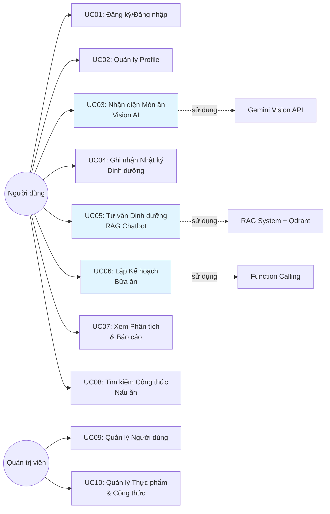

**Bảng mô tả chi tiết Use Cases chính:**

| **ID** | **Use Case** | **Actor** | **Mô tả** | **Precondition** |
|--------|--------------|-----------|-----------|------------------|
| UC01 | Đăng ký/Đăng nhập | User | Người dùng tạo tài khoản mới hoặc đăng nhập vào hệ thống bằng email/password | Người dùng có email hợp lệ |
| UC02 | Quản lý Profile | User | Cập nhật thông tin cá nhân, mục tiêu sức khỏe (giảm/tăng/duy trì cân), sở thích ăn uống, dị ứng | Đã đăng nhập |
| UC03 | Nhận diện Món ăn từ Ảnh | User | Upload/chụp ảnh món ăn, hệ thống dùng Gemini Vision AI nhận diện tên món, ước tính khối lượng và thông tin dinh dưỡng | Đã đăng nhập, có kết nối internet |
| UC04 | Ghi nhận Nhật ký Dinh dưỡng | User | Thêm món ăn vào nhật ký hàng ngày (manual hoặc từ Vision AI), xem tổng calo/protein/carbs/fat đã tiêu thụ | Đã đăng nhập |
| UC05 | Tư vấn Dinh dưỡng (Chatbot) | User | Đặt câu hỏi về dinh dưỡng, chatbot dùng RAG System tra cứu 839 documents và trả lời dựa trên nguồn khoa học | Đã đăng nhập |
| UC06 | Lập Kế hoạch Bữa ăn | User | Yêu cầu AI tạo meal plan tự động dựa trên mục tiêu calo, sở thích, thời gian nấu. Chatbot dùng Function Calling gọi backend | Đã đăng nhập, đã thiết lập mục tiêu |
| UC07 | Xem Phân tích & Báo cáo | User | Xem biểu đồ xu hướng calo/nutrition theo ngày/tuần/tháng, so sánh với mục tiêu, nhận insights | Đã đăng nhập, có dữ liệu nhật ký |
| UC08 | Tìm kiếm Công thức | User | Tìm recipes theo tên, nguyên liệu, category. Xem chi tiết công thức với ingredients, bước nấu, nutrition facts | Đã đăng nhập |
| UC09 | Quản lý Người dùng | Admin | Xem danh sách users, thống kê hoạt động, vô hiệu hóa/kích hoạt tài khoản khi cần | Đăng nhập với role admin |
| UC10 | Quản lý Foods & Recipes | Admin | Thêm/sửa/xóa (soft delete) thực phẩm và công thức trong database, cập nhật thông tin dinh dưỡng | Đăng nhập với role admin |

**Luồng xử lý chính cho UC03 (Nhận diện Món ăn từ Ảnh):**

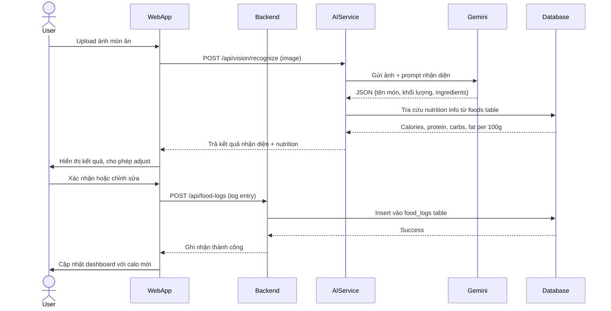

Luồng UC03 bắt đầu khi người dùng upload ảnh món ăn qua Web App, ảnh được gửi tới AI Services endpoint `/api/vision/recognize` với format multipart/form-data. AI Services xử lý ảnh bằng cách resize và optimize (max 4MB) trước khi gửi tới Google Gemini Vision API kèm prompt engineering đặc biệt. Prompt được thiết kế để Gemini trả về structured JSON chứa: tên món ăn (cả tiếng Việt và tiếng Anh), khối lượng ước tính (grams), ingredients chính, và confidence score. Sau khi nhận response từ Gemini, AI Services thực hiện fuzzy matching tên món ăn với foods table trong PostgreSQL database sử dụng RapidFuzz library để tìm món ăn tương ứng trong database. Điều này đảm bảo nutrition information chính xác từ database thay vì chỉ dựa vào ước lượng của AI. Kết quả nhận diện (tên món, khối lượng, calories, protein, carbs, fat) được trả về Web App và hiển thị cho người dùng. Người dùng có thể xác nhận ngay hoặc chỉnh sửa thông tin (thay đổi khối lượng, adjust nutrients) trước khi lưu. Khi người dùng xác nhận, Web App gọi Backend API endpoint `/api/food-logs` để lưu entry mới vào food_logs table với snapshot của nutrition values tại thời điểm ghi nhận. Backend thực hiện validation, insert vào database với user_id, food_id, date, meal_type, và snapshot nutrition. Cuối cùng dashboard của người dùng được cập nhật real-time với total calories mới và progress bar hướng tới daily goal. Toàn bộ flow này diễn ra trong vòng 3-5 giây, trong đó phần lớn thời gian là waiting for Gemini API response. Việc cache foods table trong Redis giúp bước tra cứu nutrition nhanh hơn, chỉ mất ~20ms thay vì query database mỗi lần.

**Luồng xử lý chính cho UC05 (RAG Chatbot):**

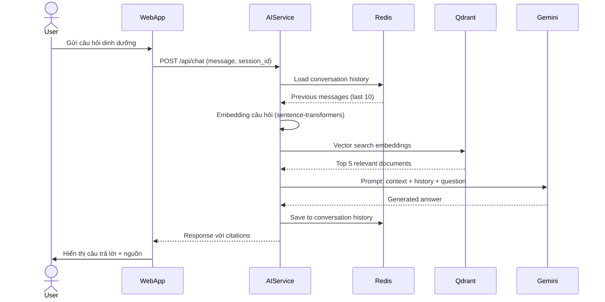

Luồng UC05 triển khai RAG (Retrieval-Augmented Generation) System để trả lời câu hỏi dinh dưỡng với độ chính xác cao dựa trên knowledge base. Khi người dùng gửi câu hỏi qua chat interface, Web App gọi AI Services endpoint `/api/chat` kèm message và session_id để maintain conversation context. AI Services đầu tiên load conversation history từ Redis cache (key pattern: `conversation:{session_id}`) để lấy 10 messages gần nhất, giúp chatbot hiểu ngữ cảnh và reference các câu hỏi trước đó. Tiếp theo, câu hỏi được transform thành 768-dimensional embedding vector sử dụng sentence-transformers model `all-MiniLM-L6-v2`. Vector này được dùng để search trong Qdrant database với 839 nutrition documents đã được indexed trước. Qdrant thực hiện cosine similarity search và trả về top 5 documents có score cao nhất (threshold > 0.7). Các documents này được format thành context string với structure: "Based on these sources: [title1: content1], [title2: content2]... Answer the question: [user_question]". Context kết hợp với conversation history tạo thành prompt đầy đủ gửi tới Google Gemini API. Gemini generate answer dựa trên context được cung cấp thay vì rely hoàn toàn vào training data, giảm thiểu hallucination và đảm bảo thông tin y khoa chính xác. Response từ Gemini bao gồm answer text và citations (references tới documents được sử dụng). Message pair (question + answer) được save vào Redis với TTL 24 giờ để maintain conversation trong session. Cuối cùng Web App hiển thị answer cho người dùng kèm source citations dưới dạng footnotes hoặc expandable references, tăng độ tin cậy của thông tin.

**Luồng xử lý chính cho UC06 (Lập Kế hoạch Bữa ăn):**

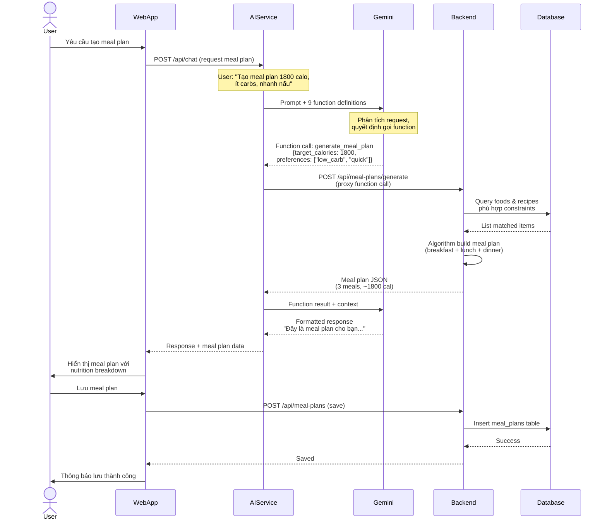

Luồng UC06 kết hợp RAG Chatbot với Function Calling capability của Gemini để tự động generate meal plan theo yêu cầu người dùng. Khi người dùng yêu cầu tạo meal plan (ví dụ: "Tạo meal plan 1800 calories mỗi ngày, ít carbs, các món nhanh nấu"), request được gửi qua chat interface tới AI Services. AI Services define 9 functions tương ứng với các actions có thể thực hiện: `search_foods`, `get_food_details`, `log_food`, `generate_meal_plan`, `get_nutrition_summary`, `get_user_goals`, `search_recipes`, `get_recipe_details`, và `calculate_nutrition`. Các function definitions này được gửi kèm trong prompt tới Gemini API với instruction để AI analyze user intent và decide function nào cần gọi. Gemini parse request của user, extract parameters (target_calories: 1800, preferences: ["low_carb", "quick_cook"]), và quyết định gọi function `generate_meal_plan` với parameters tương ứng. AI Services nhận function call decision từ Gemini, thực hiện proxy call tới Backend API endpoint `/api/meal-plans/generate` với extracted parameters. Backend algorithm query database với constraints: filter foods và recipes có carbs thấp, cooking_time ngắn, sau đó sử dụng optimization algorithm để build meal plan gồm 3 bữa (breakfast, lunch, dinner) với total calories gần 1800. Algorithm cân bằng macronutrients distribution (protein 25-30%, carbs 30-35%, fat 35-40%), đảm bảo variety (không repeat món), và prioritize user preferences. Backend trả về meal plan JSON structure chứa meal details, nutrition breakdown của từng bữa, và total daily nutrition. AI Services gửi function result này trở lại Gemini kèm context để format thành natural language response thân thiện: "Đây là meal plan cho bạn, tổng 1790 calories: Sáng - Trứng chiên + bánh mì, 450 cal...". Response kèm structured meal plan data được trả về Web App. Web App render meal plan trong UI với nutrition charts, cho phép người dùng xem chi tiết từng món, adjust portions, hoặc swap items. Khi người dùng satisfied và nhấn Save, Web App gọi Backend để persist meal plan vào meal_plans table với user_id và planned_date. User nhận thông báo lưu thành công và meal plan xuất hiện trong calendar view.

#### 3.1.2. Yêu cầu Phi chức năng

**Bảng yêu cầu phi chức năng (Non-functional Requirements):**

| **Loại Yêu cầu** | **Mô tả** | **Chỉ số Đo lường** |
|-------------------|-----------|--------------------|
| **Performance** | Response time nhanh cho các operations thường xuyên | • CRUD operations: < 200ms • Vision AI recognition: < 3s • RAG chatbot response: < 2s • Meal plan generation: < 5s |
| **Security** | Bảo mật thông tin người dùng và tuân thủ data privacy | • JWT token authentication với expiry 24h • Bcrypt hash passwords (cost factor 12) • HTTPS cho tất cả communications • Rate limiting: 100 requests/minute/IP |
| **Scalability** | Khả năng mở rộng khi số lượng users tăng | • Horizontal scaling với Docker containers • Redis cache giảm database load 60% • Database connection pooling (max 20 connections) • Static assets serve qua CDN |
| **Availability** | Hệ thống hoạt động liên tục, downtime tối thiểu | • Uptime target: 99% (cho môi trường development) • Database backup tự động daily • Health check endpoints mỗi service • Graceful shutdown và restart |
| **Usability** | Giao diện dễ sử dụng, trải nghiệm người dùng tốt | • Mobile-responsive design • Support đa ngôn ngữ (vi, en) • Accessibility WCAG 2.1 Level A • Load time first paint < 1.5s |
| **Maintainability** | Code dễ maintain, debug, và extend features mới | • Test coverage > 70% • API documentation tự động (OpenAPI/Swagger) • Logging structure với levels (INFO, ERROR) • Database migrations với Alembic |

**Giải thích chi tiết các yêu cầu quan trọng:**

1. **Performance Requirements:** Response time được optimize bằng cách sử dụng Redis cache cho frequently accessed data (foods list, user profile), async processing với FastAPI, và database indexing trên các columns thường query (email, food name, log date). Vision AI và RAG có latency cao hơn do phụ thuộc external Gemini API, nhưng vẫn nằm trong threshold chấp nhận được cho AI operations.

2. **Security Requirements:** JWT tokens được issue sau khi login thành công với payload chứa user_id và role, expire sau 24 giờ để balance giữa security và user experience. Passwords không bao giờ store plain text, luôn hash bằng bcrypt với cost factor 12 (2^12 iterations). Rate limiting ở API Gateway level ngăn chặn brute force attacks và abuse. HTTPS enforce cho production environment.

3. **Scalability Requirements:** Kiến trúc microservices cho phép scale Backend và AI Services độc lập dựa trên load. Redis cache giảm database queries lên tới 60% cho các endpoints GET frequently. Database connection pooling tránh overhead của việc tạo connection mới cho mỗi request. Static assets (images, CSS, JS bundles) được serve qua CDN để giảm latency cho users ở xa data center.

4. **Availability Requirements:** Uptime 99% tương đương ~7 giờ downtime mỗi tháng, hợp lý cho development/MVP stage. Production sẽ target 99.9% uptime. Database backup daily với retention 7 ngày giúp recovery nhanh khi có incidents. Health check endpoints (GET /health) cho phép monitoring tools detect service failures và trigger alerts.

5. **Usability - Multi-language:** Database có cột name_vi và name_en cho foods. Frontend dùng i18n libraries (react-i18next) switch ngôn ngữ.

---

## 3.2. Thiết kế Kiến trúc Hệ thống

### 3.2.1. Kiến trúc Tổng thể

Hệ thống NutriAI áp dụng kiến trúc Microservices Hybrid với hai services chính chạy độc lập, kết nối với ba databases và một external AI service. Kiến trúc này được thiết kế để tối ưu performance, scalability và maintainability.

**Sơ đồ Kiến trúc Tổng thể (System Architecture):**

```mermaid
graph TB
    subgraph "Client Layer"
        WebApp[Web App<br/>React 19 + Vite]
        MobileApp[Mobile App<br/>Flutter 3.x]
    end
    
    subgraph "API Gateway Layer"
        NGINX[NGINX<br/>Reverse Proxy<br/>Load Balancer]
    end
    
    subgraph "Application Layer - Docker Compose"
        Backend[Backend API<br/>FastAPI:8000<br/>24 endpoints]
        AIService[AI Services<br/>FastAPI:8001<br/>15 endpoints]
    end
    
    subgraph "External Services"
        Gemini[Google Gemini API<br/>Vision + Chat + Function Calling]
    end
    
    subgraph "Data Layer"
        PostgreSQL[(PostgreSQL 15<br/>Relational DB<br/>15 tables)]
        Redis[(Redis 7<br/>Cache + Sessions<br/>+ Conversations)]
        Qdrant[(Qdrant<br/>Vector DB<br/>839 documents)]
    end
    
    subgraph "Management Tools"
        PgAdmin[pgAdmin<br/>:5050]
        RedisCmd[redis-commander<br/>:8081]
    end
    
    WebApp --> NGINX
    MobileApp --> NGINX
    
    NGINX --> Backend
    NGINX --> AIService
    
    Backend --> PostgreSQL
    Backend --> Redis
    
    AIService --> Qdrant
    AIService --> Redis
    AIService --> Gemini
    AIService -.->|Function Calling| Backend
    
    PgAdmin -.-> PostgreSQL
    RedisCmd -.-> Redis
    
    style Backend fill:#4CAF50
    style AIService fill:#2196F3
    style Gemini fill:#FF9800
    style PostgreSQL fill:#336791
    style Redis fill:#DC382D
    style Qdrant fill:#24386C
```

**Giải thích kiến trúc:**

1. **Client Layer:** Web application (React 19) và Mobile app (Flutter) đều gọi APIs thông qua NGINX reverse proxy để load balancing và SSL termination.

2. **Application Layer:** Hai FastAPI services chạy độc lập trong Docker containers:
   - **Backend API (port 8000):** Xử lý authentication, CRUD operations, business logic chuẩn.
   - **AI Services (port 8001):** Chuyên biệt cho AI tasks (Vision, RAG, Function Calling), tách riêng để scale và optimize độc lập.

3. **Data Layer:**
   - **PostgreSQL:** Lưu trữ structured data (users, foods, logs, recipes, meal plans).
   - **Redis:** Cache layer cho performance + session management + conversation history.
   - **Qdrant:** Vector database cho RAG System, lưu embeddings của 839 nutrition documents.

4. **External Services:** Google Gemini API xử lý multimodal AI tasks, được gọi từ AI Services với API key authentication.

5. **Management Tools:** pgAdmin và redis-commander cung cấp GUI để debug và monitor databases trong development.

### 3.2.2. Kiến trúc Backend API

Backend API được tổ chức theo Layered Architecture với separation of concerns rõ ràng, áp dụng nguyên tắc Single Responsibility Principle (SRP) từ SOLID principles. Kiến trúc này chia hệ thống thành 4 layers độc lập: Routes Layer (API endpoints), Services Layer (business logic), Models Layer (ORM và data schema), và Data Layer (PostgreSQL + Redis). Mỗi layer có trách nhiệm cụ thể và communicate với nhau thông qua well-defined interfaces, đảm bảo loose coupling và high cohesion. Routes Layer chỉ xử lý HTTP requests/responses và validation, không chứa business logic. Services Layer tập trung toàn bộ business rules, algorithms phức tạp, và orchestrate các operations giữa nhiều models. Models Layer sử dụng SQLAlchemy ORM để abstract database interactions, cung cấp type-safe queries và automatic migrations. Data Layer bao gồm PostgreSQL cho persistent storage và Redis cho caching, sessions management. Kiến trúc này mang lại nhiều lợi ích: dễ test từng layer riêng biệt với unit tests và mocks, dễ maintain khi business rules thay đổi chỉ cần sửa Services Layer, dễ scale horizontal bằng cách tách Services thành microservices riêng nếu cần, và dễ onboarding developers mới nhờ structure rõ ràng.

**Sơ đồ Component Backend API:**

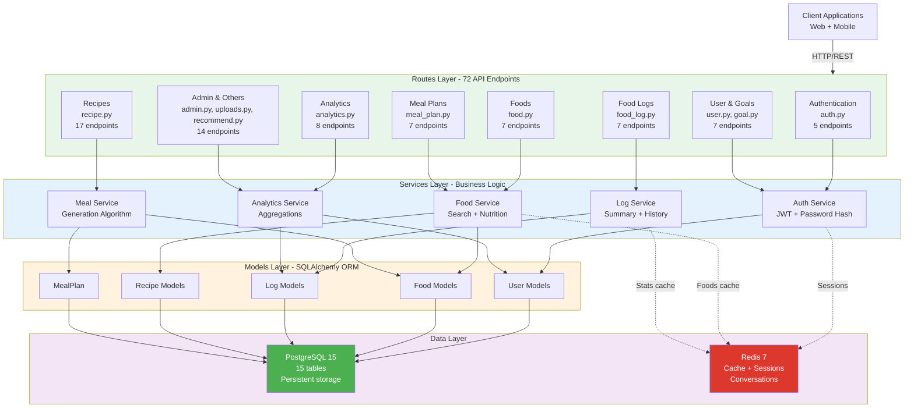

**Bảng API Endpoints Backend chính (72 endpoints, hiển thị 28 endpoints quan trọng nhất):**

| **Nhóm** | **Method** | **Endpoint** | **Mô tả** | **Auth** |
|----------|-----------|--------------|-----------|----------|
| **Authentication (5)** | POST | `/api/auth/register` | Đăng ký tài khoản mới với email, password | No |
| | POST | `/api/auth/login` | Đăng nhập, nhận access + refresh token | No |
| | POST | `/api/auth/refresh` | Refresh access token khi hết hạn | No |
| | GET | `/api/auth/me` | Lấy thông tin user hiện tại | Yes |
| | POST | `/api/auth/logout` | Logout, invalidate tokens | Yes |
| **User Management (7)** | GET | `/api/users/profile` | Lấy thông tin profile đầy đủ | Yes |
| | PATCH | `/api/users/profile` | Cập nhật profile (name, avatar, bio) | Yes |
| | POST | `/api/goals` | Tạo mục tiêu sức khỏe mới | Yes |
| | GET | `/api/goals/active` | Lấy goal đang active | Yes |
| | PATCH | `/api/goals/{goal_id}` | Cập nhật goal (target, type) | Yes |
| **Foods (7)** | GET | `/api/foods` | List foods với pagination | Yes |
| | GET | `/api/foods/search` | Tìm kiếm foods theo query, category | Yes |
| | GET | `/api/foods/barcode/{barcode}` | Tra cứu food bằng barcode scanner | Yes |
| | GET | `/api/foods/{food_id}` | Chi tiết món ăn + servings suggestions | Yes |
| | POST | `/api/foods` | Thêm món ăn mới (Admin) | Admin |
| **Food Logs (7)** | POST | `/api/food-logs` | Ghi nhận món ăn mới vào log | Yes |
| | GET | `/api/food-logs/summary` | Tổng calories/nutrition hôm nay | Yes |
| | GET | `/api/food-logs` | Lấy logs theo date range | Yes |
| | POST | `/api/food-logs/weight` | Ghi nhận cân nặng | Yes |
| | GET | `/api/food-logs/weight/latest` | Lấy cân nặng mới nhất | Yes |
| **Recipes (17)** | GET | `/api/recipes` | List recipes với pagination | Yes |
| | GET | `/api/recipes/search` | Tìm kiếm recipes theo query | Yes |
| | GET | `/api/recipes/{recipe_id}` | Chi tiết recipe + steps + nutrition | Yes |
| | POST | `/api/recipes/{recipe_id}/favorite` | Thêm vào favorites | Yes |
| | POST | `/api/recipes/match-ingredients` | Tìm recipes từ ingredients có sẵn | Yes |
| **Meal Plans (7)** | POST | `/api/meal-plans/generate` | Generate meal plan tự động bằng AI | Yes |
| | GET | `/api/meal-plans/{plan_id}` | Chi tiết meal plan | Yes |
| | POST | `/api/meal-plans/{plan_id}/regenerate-day` | Tạo lại meals cho 1 ngày cụ thể | Yes |
| **Analytics (8)** | GET | `/api/analytics/nutrition-trends` | Xu hướng dinh dưỡng theo thời gian | Yes |
| | GET | `/api/analytics/weight-progress` | Biểu đồ tiến trình cân nặng | Yes |
| | GET | `/api/analytics/weekly-summary` | Tổng kết tuần với insights | Yes |
| **Uploads (6)** | POST | `/api/uploads/food-image` | Upload ảnh món ăn | Yes |
| | POST | `/api/uploads/profile-image` | Upload ảnh profile | Yes |
| **Recommendations (3)** | GET | `/api/recommend/next-meal` | Gợi ý món cho bữa tiếp theo | Yes |
| **Admin (5)** | GET | `/api/admin/users` | List users với filters, pagination | Admin |
| | PATCH | `/api/admin/users/{user_id}/status` | Cập nhật status user | Admin |
| | GET | `/api/admin/stats` | Dashboard statistics tổng quan | Admin |

**Tổng kết API Backend:**
- **72 endpoints** phân bố: Authentication (5), User & Goals (7), Foods (7), Food Logs (7), Recipes (17), Meal Plans (7), Analytics (8), Uploads (6), Recommendations (3), Admin (5)
- **RESTful design** với HTTP methods chuẩn (GET, POST, PATCH, DELETE)
- **3 mức authorization**: Public (no auth), User (JWT required), Admin (role-based)
- **Pagination** cho list endpoints, **filtering** cho search, **rate limiting** cho tất cả endpoints

### 3.2.3. Kiến trúc AI Services

AI Services được thiết kế modular với ba component chính, mỗi component xử lý một loại AI task riêng biệt và có thể optimize độc lập.

**Sơ đồ Component AI Services:**

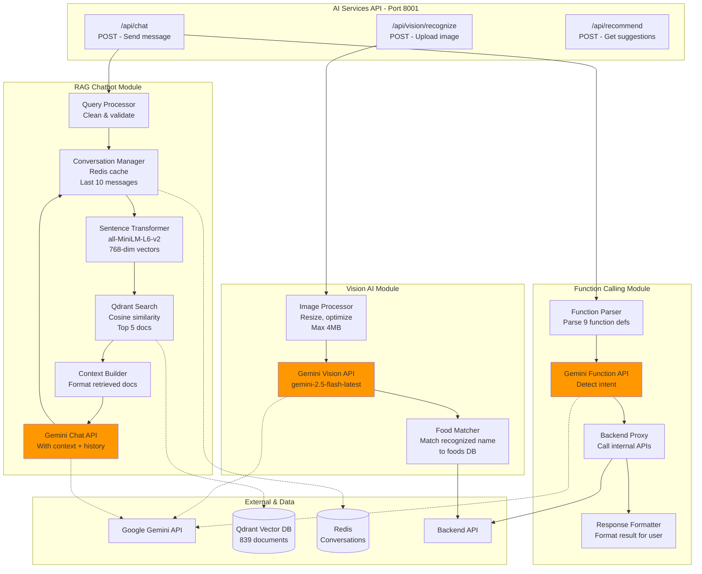

**Chi tiết từng module:**

**1. Vision AI Module:**
   - Input: Image file (JPEG/PNG, max 4MB)
   - Process: Resize → Optimize → Send to Gemini Vision với prompt engineering
   - Gemini trả về: Tên món (vi + en), khối lượng ước tính (grams), ingredients chính, confidence score
   - Food Matcher: Fuzzy match tên món với foods table trong database để lấy nutrition info chính xác
   - Output: JSON {food_name, quantity, calories, protein, carbs, fat, confidence}

**2. RAG Chatbot Module:**
   - Input: User question + session_id
   - Step 1: Load last 10 messages từ Redis (conversation_history:{session_id})
   - Step 2: Embedding question bằng sentence-transformers (768-dim vector)
   - Step 3: Qdrant similarity search → Top 5 documents với score > 0.7
   - Step 4: Build context string: "Based on these sources: [doc1], [doc2]... answer: [question]"
   - Step 5: Gửi Gemini với context + history → Generate answer
   - Step 6: Save message pair (question + answer) vào Redis với TTL 24h
   - Output: Answer text + citations (source references)

**3. Function Calling Module:**
   - Input: User intent (e.g., "Tạo meal plan 1800 calo")
   - Step 1: Define 9 functions (search_foods, log_food, generate_meal_plan, get_nutrition_summary, etc.)
   - Step 2: Gemini analyze intent → Decide which function to call + extract parameters
   - Step 3: Backend Proxy execute function bằng cách gọi corresponding Backend API endpoint 
   - Step 4: Function result trả về Gemini → Format thành natural language response
   - Output: Formatted response + structured data (meal plan, nutrition summary, etc.)

---

## 3.3. Thiết kế Cơ sở Dữ liệu

### 3.3.1. Tổng quan Database Architecture

Hệ thống NutriAI sử dụng PostgreSQL 15 làm primary database với **15 tables được tổ chức theo 4 domains** rõ ràng: User Profile Domain (4 tables), Food Domain (4 tables), Recipe Domain (3 tables), và Meal Planning Domain (2 tables), cộng với 2 junction tables. Domain-based organization này giúp dễ understand, maintain, và scale từng phần của hệ thống độc lập.

**Database Structure Overview:**

| **Domain** | **Tables** | **Purpose** | **Key Pattern** |
|------------|-----------|-------------|----------------|
| **User Profile** | users, user_goals, user_preferences, weight_logs | Personal data, health goals, weight tracking | CASCADE delete, JSONB preferences |
| **Food** | foods, food_servings, food_logs, portion_presets | Food catalog, nutrition data, daily logs | Snapshot pattern, soft delete |
| **Recipe** | recipes, recipe_ingredients, user_favorite_recipes | Cooking instructions, ingredients, favorites | JSONB steps, many-to-many |
| **Meal Planning** | meal_plans, meal_plan_items | AI-generated plans, daily meals | Polymorphic FK, JSONB constraints |

**Lý do chọn PostgreSQL:**
- **ACID Compliance:** Critical cho nutrition data consistency và financial transactions (nếu có premium features).
- **JSONB Data Type:** Lưu trữ flexible data như user preferences, meal plan constraints, recipe instructions mà không cần ALTER TABLE khi add new options.
- **Advanced Indexing:** B-tree cho primary lookups, GIN indexes cho JSONB queries, composite indexes cho multi-column filters (user_id + date).
- **Mature Ecosystem:** SQLAlchemy ORM support tốt, Alembic migrations đơn giản, pgAdmin GUI cho debugging.
- **Performance:** Connection pooling (max 20), query planner optimization, EXPLAIN ANALYZE cho tuning, partitioning potential cho food_logs table khi scale.

**Cross-Domain Design Patterns:**

1. **UUID Primary Keys toàn bộ tables:** Distributed-friendly (no ID collision), security (không expose business metrics), và support cho distributed systems future. Trade-off: 16 bytes vs 4 bytes INT, nhưng acceptable với modern infrastructure.

2. **Domain-Based Foreign Key Strategies:**
   - **User Profile Domain:** CASCADE delete khi user deleted (GDPR compliance, owned data).
   - **Food Domain:** SET NULL cho logs/ingredients (preserve historical data với snapshot pattern).
   - **Recipe Domain:** CASCADE cho ingredients/presets, SET NULL cho references.
   - **Meal Planning:** CASCADE cho items (owned by plan), SET NULL cho food/recipe references.

3. **Snapshot Pattern cho Historical Accuracy:** Food Domain và Recipe Domain lưu snapshot của values tại creation time thay vì chỉ foreign keys. Critical cho nutrition tracking vì admin có thể update nutrition info, nhưng user logs phải preserve original values.

4. **Soft Delete cho User-Facing Data:** USERS, FOODS, RECIPES, MEAL_PLANS tables dùng `is_deleted` flag. Supporting tables (FOOD_SERVINGS, RECIPE_INGREDIENTS) dùng CASCADE delete. Trade-off: storage overhead vs data recovery capability.

5. **JSONB cho Flexible Schemas:** User preferences (dietary_restrictions, allergies), meal plan constraints (budget, time), recipe instructions (steps array) lưu JSONB. GIN indexes support fast queries. Validation ở application layer với Pydantic schemas.

6. **Composite Indexes theo Access Patterns:**
   - User Profile: `(user_id, log_date DESC)` cho weight progress
   - Food Domain: `(user_id, log_date, meal_type)` cho daily nutrition summary
   - Recipe Domain: `(category, difficulty)` cho recipe search  
   - Meal Planning: `(plan_id, planned_date)` cho calendar view

### 3.3.2. Sơ đồ ERD theo Domain

Database được tổ chức thành 4 domains độc lập với USERS làm trung tâm. Mỗi domain có ERD riêng để dễ đọc và dễ hiểu.

#### 3.3.2.1. User Profile Domain

Domain này quản lý thông tin cá nhân của user, bao gồm health goals, dietary preferences, và weight tracking history.

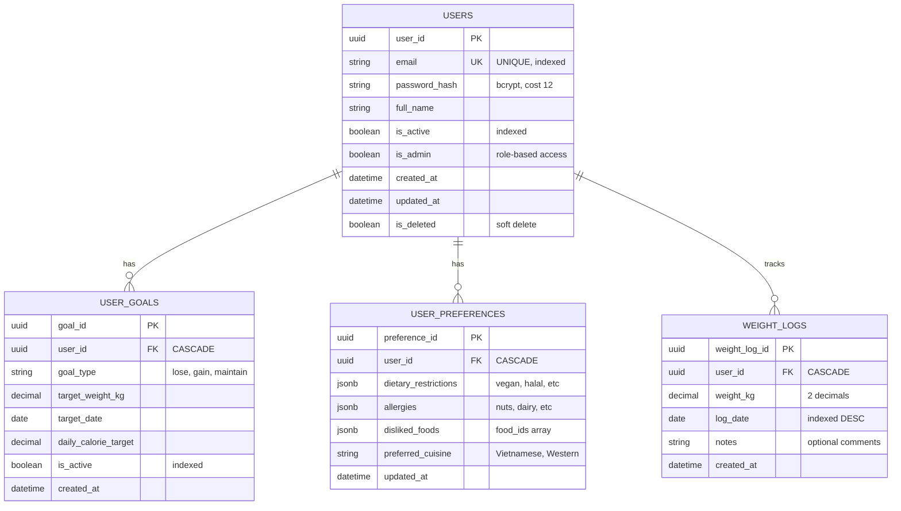

**Relationships:**
- **USERS → USER_GOALS (1-to-many, CASCADE):** Một user có thể có nhiều goals theo thời gian, nhưng chỉ một goal active tại một thời điểm (controlled bởi is_active flag).
- **USERS → USER_PREFERENCES (1-to-1, CASCADE):** Mỗi user có một preference record duy nhất, lưu dietary restrictions và allergies dạng JSONB cho flexibility.
- **USERS → WEIGHT_LOGS (1-to-many, CASCADE):** User track cân nặng theo thời gian để monitor progress hướng tới goal. Index DESC trên log_date để query latest weight nhanh.

#### 3.3.2.2. Food Domain

Domain này quản lý food catalog, serving sizes, và food consumption logs với snapshot pattern.

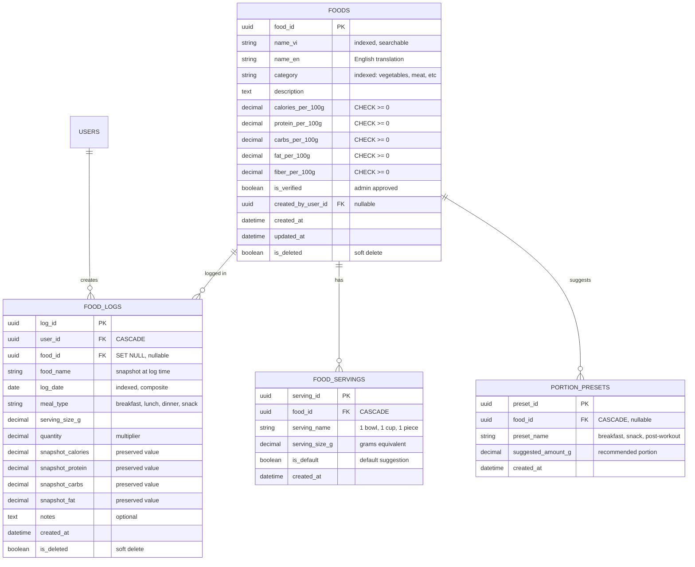

**Relationships:**
- **FOODS → FOOD_SERVINGS (1-to-many, CASCADE):** Mỗi food có nhiều serving options (1 chén, 1 bát, 100g). Khi food deleted, servings cũng deleted.
- **USERS → FOOD_LOGS (1-to-many, CASCADE):** Users tạo logs hàng ngày để track nutrition intake. Composite index (user_id, log_date) optimize queries "all logs của user X trong tháng Y".
- **FOODS → FOOD_LOGS (1-to-many, SET NULL):** Food logs reference food nhưng nullable. Khi food deleted, food_id set NULL nhưng snapshot values preserved cho historical accuracy.
- **FOODS → PORTION_PRESETS (1-to-many, CASCADE):** Gợi ý portions cho contexts khác nhau (breakfast thường nhỏ hơn dinner).

**Snapshot Pattern:** FOOD_LOGS lưu snapshot của nutrition values thay vì chỉ foreign key. Pattern này critical vì admin có thể update nutrition info trong FOODS table (VD: sửa calories của "cơm trắng"), nhưng historical logs phải giữ nguyên values tại thời điểm user ăn.

#### 3.3.2.3. Recipe Domain

Domain này quản lý cooking recipes, ingredients, và user favorites với many-to-many relationship.

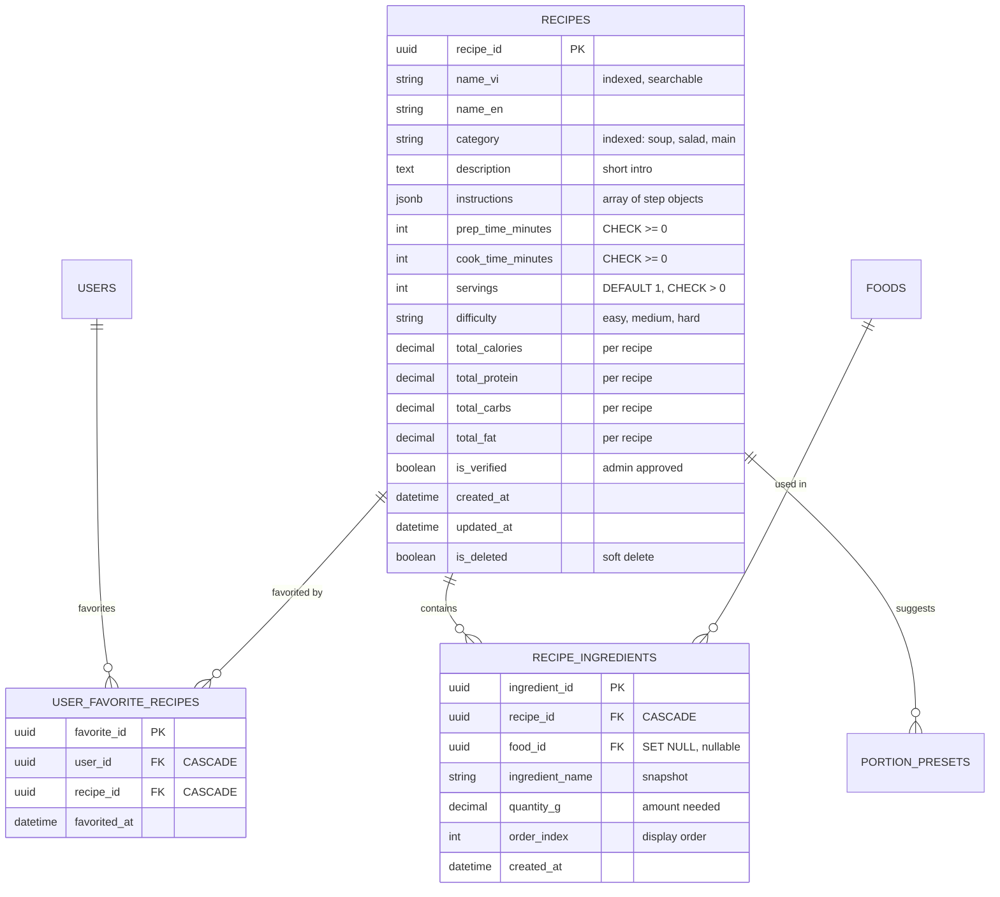

**Relationships:**
- **RECIPES → RECIPE_INGREDIENTS (1-to-many, CASCADE):** Một recipe chứa nhiều ingredients. Mỗi ingredient reference tới FOODS table để lấy nutrition info. Khi recipe deleted, ingredients cũng deleted.
- **FOODS → RECIPE_INGREDIENTS (1-to-many, SET NULL):** Ingredients reference foods, nhưng khi food deleted thì food_id set NULL và giữ ingredient_name snapshot.
- **USERS ↔ RECIPES (many-to-many):** Junction table USER_FAVORITE_RECIPES với composite unique index (user_id, recipe_id) ngăn duplicate favorites.
- **RECIPES → PORTION_PRESETS (1-to-many, CASCADE):** Gợi ý portions cho recipes tương tự foods.

**JSONB Instructions:** Recipe steps lưu dạng JSONB array `[{step: 1, text: "Rửa rau", image_url: "..."}, ...]` thay vì separate table. Flexible và query performance tốt cho read-heavy workload.

#### 3.3.2.4. Meal Planning Domain

Domain này quản lý AI-generated meal plans với polymorphic relationships tới cả FOODS và RECIPES.

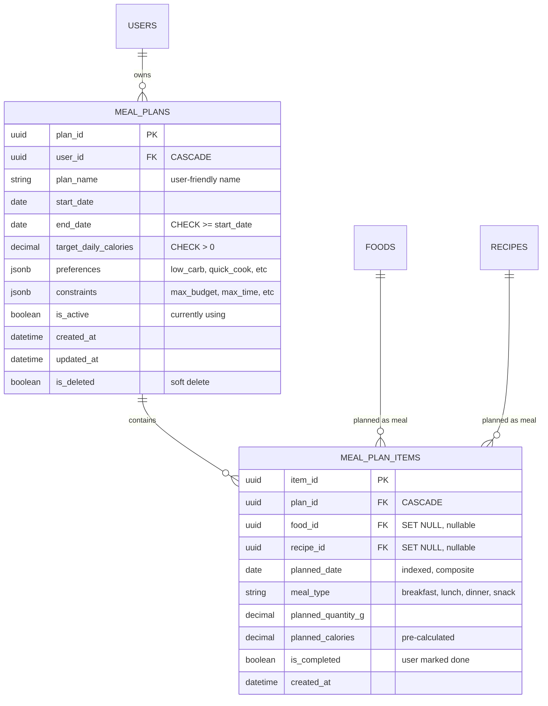

**Relationships:**
- **USERS → MEAL_PLANS (1-to-many, CASCADE):** User có thể có nhiều meal plans (weekly plan, special diet plan), nhưng thường chỉ một plan active.
- **MEAL_PLANS → MEAL_PLAN_ITEMS (1-to-many, CASCADE):** Một plan chứa nhiều items cho multiple dates. Composite index (plan_id, planned_date) optimize query "all meals for date X".
- **FOODS → MEAL_PLAN_ITEMS (1-to-many, SET NULL):** Polymorphic relationship - item có thể là simple food.
- **RECIPES → MEAL_PLAN_ITEMS (1-to-many, SET NULL):** Hoặc item có thể là full recipe.

**Polymorphic Pattern:** MEAL_PLAN_ITEMS có cả food_id và recipe_id, cả hai đều nullable. Validation ở application layer đảm bảo exactly one trong hai có value. Pattern này cho flexibility: AI có thể suggest simple food (apple, banana) hoặc complex recipe (grilled chicken salad).

**JSONB Preferences & Constraints:** Meal plan preferences (low_carb, high_protein, vegetarian, quick_cook) và constraints (max_budget, max_time, available_ingredients) lưu dạng JSONB. AI algorithm đọc JSONB này để generate appropriate meal suggestions.

### 3.3.3. Chi tiết Schema Tables theo Domain

Phần này mô tả chi tiết columns, constraints, và indexes của các tables trong từng domain.

#### 3.3.3.1. User Profile Domain Tables

**USERS** - Central authentication và profile table

| **Column** | **Type** | **Constraints** | **Description** |
|-----------|---------|----------------|-----------------|
| user_id | UUID | PRIMARY KEY | Unique identifier (gen_random_uuid()) |
| email | VARCHAR(255) | UNIQUE, NOT NULL, INDEXED | Login credential, case-insensitive |
| password_hash | VARCHAR(255) | NOT NULL | Bcrypt hashed (cost factor 12, 2^12 iterations) |
| full_name | VARCHAR(255) | NULL | Display name in UI |
| is_active | BOOLEAN | NOT NULL, DEFAULT true, INDEXED | Account enabled/disabled status |
| is_admin | BOOLEAN | NOT NULL, DEFAULT false | Role-based access control flag |
| created_at | TIMESTAMPTZ | NOT NULL, DEFAULT CURRENT_TIMESTAMP | Account creation time |
| updated_at | TIMESTAMPTZ | NOT NULL, DEFAULT CURRENT_TIMESTAMP | Last profile update (auto-update trigger) |
| is_deleted | BOOLEAN | NOT NULL, DEFAULT false | Soft delete flag (GDPR compliance) |

**USER_GOALS** - Health goals tracking (lose/gain/maintain weight)

| **Column** | **Type** | **Constraints** | **Description** |
|-----------|---------|----------------|-----------------|
| goal_id | UUID | PRIMARY KEY | Unique identifier |
| user_id | UUID | NOT NULL, FK → users(user_id) ON DELETE CASCADE | Owner |
| goal_type | VARCHAR(20) | NOT NULL, CHECK IN (lose, gain, maintain) | Goal category |
| target_weight_kg | DECIMAL(5,2) | NOT NULL, CHECK > 0 | Target weight (e.g., 65.50) |
| target_date | DATE | NULL | Optional deadline date |
| daily_calorie_target | DECIMAL(6,2) | NOT NULL, CHECK > 0 | Calculated calorie goal (e.g., 1800.00) |
| is_active | BOOLEAN | NOT NULL, DEFAULT true, INDEXED | Only one goal active per user |
| created_at | TIMESTAMPTZ | NOT NULL, DEFAULT CURRENT_TIMESTAMP | Goal creation time |

**USER_PREFERENCES** - Dietary restrictions và preferences

| **Column** | **Type** | **Constraints** | **Description** |
|-----------|---------|----------------|-----------------|
| preference_id | UUID | PRIMARY KEY | Unique identifier |
| user_id | UUID | NOT NULL, UNIQUE, FK → users(user_id) ON DELETE CASCADE | Owner (1-to-1) |
| dietary_restrictions | JSONB | NULL | {"vegan": true, "halal": false, "keto": true} |
| allergies | JSONB | NULL | {"nuts": true, "dairy": true, "gluten": false} |
| disliked_foods | JSONB | NULL | ["food_id_1", "food_id_2"] array |
| preferred_cuisine | VARCHAR(50) | NULL | "Vietnamese", "Western", "Asian Fusion" |
| updated_at | TIMESTAMPTZ | NOT NULL, DEFAULT CURRENT_TIMESTAMP | Last preference update |

**WEIGHT_LOGS** - Daily weight tracking for progress monitoring

| **Column** | **Type** | **Constraints** | **Description** |
|-----------|---------|----------------|-----------------|
| weight_log_id | UUID | PRIMARY KEY | Unique identifier |
| user_id | UUID | NOT NULL, FK → users(user_id) ON DELETE CASCADE, INDEXED | Owner |
| weight_kg | DECIMAL(5,2) | NOT NULL, CHECK > 0 | Weight value (e.g., 68.50) |
| log_date | DATE | NOT NULL, INDEXED | Date of measurement |
| notes | TEXT | NULL | Optional notes (e.g., "after workout") |
| created_at | TIMESTAMPTZ | NOT NULL, DEFAULT CURRENT_TIMESTAMP | Log creation time |

**Composite Index:** `CREATE INDEX idx_weight_logs_user_date ON weight_logs(user_id, log_date DESC);` - Optimize query "latest 30 weight entries for user"

#### 3.3.3.2. Food Domain Tables

**FOODS** - Food catalog với nutrition information per 100g

| **Column** | **Type** | **Constraints** | **Description** |
|-----------|---------|----------------|-----------------|
| food_id | UUID | PRIMARY KEY | Unique identifier |
| name_vi | VARCHAR(255) | NOT NULL, INDEXED | Vietnamese name (e.g., "Cơm trắng") |
| name_en | VARCHAR(255) | NULL | English translation (e.g., "White rice") |
| category | VARCHAR(100) | NOT NULL, INDEXED | "vegetables", "meat", "grains", "fruits" |
| description | TEXT | NULL | Additional info (origin, benefits) |
| calories_per_100g | DECIMAL(8,2) | NOT NULL, CHECK >= 0 | Calories per 100g |
| protein_per_100g | DECIMAL(8,2) | NOT NULL, CHECK >= 0 | Protein grams per 100g |
| carbs_per_100g | DECIMAL(8,2) | NOT NULL, CHECK >= 0 | Carbohydrates grams per 100g |
| fat_per_100g | DECIMAL(8,2) | NOT NULL, CHECK >= 0 | Fat grams per 100g |
| fiber_per_100g | DECIMAL(8,2) | NULL, CHECK >= 0 | Dietary fiber grams per 100g |
| is_verified | BOOLEAN | NOT NULL, DEFAULT false | Admin approval status |
| created_by_user_id | UUID | NULL, FK → users(user_id) ON DELETE SET NULL | Track creator (nullable) |
| created_at | TIMESTAMPTZ | NOT NULL, DEFAULT CURRENT_TIMESTAMP | Creation time |
| updated_at | TIMESTAMPTZ | NOT NULL, DEFAULT CURRENT_TIMESTAMP | Last update time |
| is_deleted | BOOLEAN | NOT NULL, DEFAULT false | Soft delete flag |

**Composite Index:** `CREATE INDEX idx_foods_category_name ON foods(category, name_vi);` - Support category filtering + alphabetical listing

**FOOD_SERVINGS** - Serving size suggestions (1 bowl, 1 cup, etc.)

| **Column** | **Type** | **Constraints** | **Description** |
|-----------|---------|----------------|-----------------|
| serving_id | UUID | PRIMARY KEY | Unique identifier |
| food_id | UUID | NOT NULL, FK → foods(food_id) ON DELETE CASCADE | Parent food |
| serving_name | VARCHAR(100) | NOT NULL | "1 chén", "1 bát", "1 miếng", "100g" |
| serving_size_g | DECIMAL(8,2) | NOT NULL, CHECK > 0 | Grams equivalent (e.g., 1 bowl = 200g) |
| is_default | BOOLEAN | NOT NULL, DEFAULT false | Default suggestion in UI |
| created_at | TIMESTAMPTZ | NOT NULL, DEFAULT CURRENT_TIMESTAMP | Creation time |

**FOOD_LOGS** - Daily food consumption logs với snapshot pattern

| **Column** | **Type** | **Constraints** | **Description** |
|-----------|---------|----------------|-----------------|
| log_id | UUID | PRIMARY KEY | Unique identifier |
| user_id | UUID | NOT NULL, FK → users(user_id) ON DELETE CASCADE, INDEXED | Owner |
| food_id | UUID | NULL, FK → foods(food_id) ON DELETE SET NULL | Reference (nullable) |
| food_name | VARCHAR(255) | NOT NULL | **Snapshot** of food name at log time |
| log_date | DATE | NOT NULL, INDEXED | Date of consumption |
| meal_type | VARCHAR(50) | NOT NULL, CHECK IN (breakfast, lunch, dinner, snack) | Meal category |
| serving_size_g | DECIMAL(8,2) | NOT NULL, CHECK > 0 | Portion size in grams |
| quantity | DECIMAL(5,2) | NOT NULL, CHECK > 0, DEFAULT 1.0 | Multiplier (e.g., 1.5 bowls) |
| snapshot_calories | DECIMAL(8,2) | NOT NULL | **Snapshot** calories at log time |
| snapshot_protein | DECIMAL(8,2) | NOT NULL | **Snapshot** protein at log time |
| snapshot_carbs | DECIMAL(8,2) | NOT NULL | **Snapshot** carbs at log time |
| snapshot_fat | DECIMAL(8,2) | NOT NULL | **Snapshot** fat at log time |
| notes | TEXT | NULL | Optional user comments |
| created_at | TIMESTAMPTZ | NOT NULL, DEFAULT CURRENT_TIMESTAMP | Log creation time |
| is_deleted | BOOLEAN | NOT NULL, DEFAULT false | Soft delete flag |

**Composite Indexes:** 
- `CREATE INDEX idx_food_logs_user_date ON food_logs(user_id, log_date);` - Daily nutrition summary query
- `CREATE INDEX idx_food_logs_user_meal_date ON food_logs(user_id, meal_type, log_date);` - Meal-specific queries

**PORTION_PRESETS** - Context-based portion suggestions

| **Column** | **Type** | **Constraints** | **Description** |
|-----------|---------|----------------|-----------------|
| preset_id | UUID | PRIMARY KEY | Unique identifier |
| food_id | UUID | NULL, FK → foods(food_id) ON DELETE CASCADE | Food reference (nullable) |
| preset_name | VARCHAR(100) | NOT NULL | "breakfast", "snack", "post-workout" |
| suggested_amount_g | DECIMAL(8,2) | NOT NULL, CHECK > 0 | Recommended portion (context-dependent) |
| created_at | TIMESTAMPTZ | NOT NULL, DEFAULT CURRENT_TIMESTAMP | Creation time |

#### 3.3.3.3. Recipe Domain Tables

**RECIPES** - Cooking recipes với instructions và nutrition totals

| **Column** | **Type** | **Constraints** | **Description** |
|-----------|---------|----------------|-----------------|
| recipe_id | UUID | PRIMARY KEY | Unique identifier |
| name_vi | VARCHAR(255) | NOT NULL, INDEXED | Vietnamese name (e.g., "Canh chua cá") |
| name_en | VARCHAR(255) | NULL | English translation |
| category | VARCHAR(100) | NOT NULL, INDEXED | "soup", "salad", "main_dish", "dessert" |
| description | TEXT | NULL | Short introduction/overview |
| instructions | JSONB | NOT NULL | Array: [{step: 1, text: "...", image_url: "..."}] |
| prep_time_minutes | INTEGER | NULL, CHECK >= 0 | Preparation time |
| cook_time_minutes | INTEGER | NULL, CHECK >= 0 | Cooking time |
| servings | INTEGER | NOT NULL, CHECK > 0, DEFAULT 1 | Number of servings recipe makes |
| difficulty | VARCHAR(20) | NOT NULL, CHECK IN (easy, medium, hard) | Skill level required |
| total_calories | DECIMAL(10,2) | NULL | Total calories per recipe (calculated) |
| total_protein | DECIMAL(10,2) | NULL | Total protein per recipe |
| total_carbs | DECIMAL(10,2) | NULL | Total carbs per recipe |
| total_fat | DECIMAL(10,2) | NULL | Total fat per recipe |
| is_verified | BOOLEAN | NOT NULL, DEFAULT false | Admin approval status |
| created_at | TIMESTAMPTZ | NOT NULL, DEFAULT CURRENT_TIMESTAMP | Creation time |
| updated_at | TIMESTAMPTZ | NOT NULL, DEFAULT CURRENT_TIMESTAMP | Last update time |
| is_deleted | BOOLEAN | NOT NULL, DEFAULT false | Soft delete flag |

**Composite Index:** `CREATE INDEX idx_recipes_category_difficulty ON recipes(category, difficulty);` - Recipe search with filters

**RECIPE_INGREDIENTS** - Ingredients list cho recipes với snapshot pattern

| **Column** | **Type** | **Constraints** | **Description** |
|-----------|---------|----------------|-----------------|
| ingredient_id | UUID | PRIMARY KEY | Unique identifier |
| recipe_id | UUID | NOT NULL, FK → recipes(recipe_id) ON DELETE CASCADE, INDEXED | Parent recipe |
| food_id | UUID | NULL, FK → foods(food_id) ON DELETE SET NULL | Food reference |
| ingredient_name | VARCHAR(255) | NOT NULL | **Snapshot** of ingredient name |
| quantity_g | DECIMAL(8,2) | NOT NULL, CHECK > 0 | Amount needed in grams |
| order_index | INTEGER | NOT NULL, DEFAULT 0 | Display order in ingredients list |
| created_at | TIMESTAMPTZ | NOT NULL, DEFAULT CURRENT_TIMESTAMP | Creation time |

**USER_FAVORITE_RECIPES** - Many-to-many junction table

| **Column** | **Type** | **Constraints** | **Description** |
|-----------|---------|----------------|-----------------|
| favorite_id | UUID | PRIMARY KEY | Unique identifier |
| user_id | UUID | NOT NULL, FK → users(user_id) ON DELETE CASCADE | User who favorited |
| recipe_id | UUID | NOT NULL, FK → recipes(recipe_id) ON DELETE CASCADE | Recipe favorited |
| favorited_at | TIMESTAMPTZ | NOT NULL, DEFAULT CURRENT_TIMESTAMP | Favorite timestamp |

**Composite Unique Index:** `CREATE UNIQUE INDEX idx_user_favorite_recipes ON user_favorite_recipes(user_id, recipe_id);` - Prevent duplicate favorites

#### 3.3.3.4. Meal Planning Domain Tables

**MEAL_PLANS** - AI-generated weekly/monthly meal plans

| **Column** | **Type** | **Constraints** | **Description** |
|-----------|---------|----------------|-----------------|
| plan_id | UUID | PRIMARY KEY | Unique identifier |
| user_id | UUID | NOT NULL, FK → users(user_id) ON DELETE CASCADE, INDEXED | Owner |
| plan_name | VARCHAR(255) | NOT NULL | User-friendly name (e.g., "Week 1 - Low Carb") |
| start_date | DATE | NOT NULL | Plan start date |
| end_date | DATE | NOT NULL, CHECK (end_date >= start_date) | Plan end date (logical check) |
| target_daily_calories | DECIMAL(8,2) | NULL, CHECK > 0 | Daily calorie target |
| preferences | JSONB | NULL | {"low_carb": true, "quick_cook": true, "vegetarian": false} |
| constraints | JSONB | NULL | {"max_budget": 200000, "max_time": 30, "no_seafood": true} |
| is_active | BOOLEAN | NOT NULL, DEFAULT true | Currently using plan |
| created_at | TIMESTAMPTZ | NOT NULL, DEFAULT CURRENT_TIMESTAMP | Creation time |
| updated_at | TIMESTAMPTZ | NOT NULL, DEFAULT CURRENT_TIMESTAMP | Last update time |
| is_deleted | BOOLEAN | NOT NULL, DEFAULT false | Soft delete flag |

**MEAL_PLAN_ITEMS** - Individual meals trong plan với polymorphic FKs

| **Column** | **Type** | **Constraints** | **Description** |
|-----------|---------|----------------|-----------------|
| item_id | UUID | PRIMARY KEY | Unique identifier |
| plan_id | UUID | NOT NULL, FK → meal_plans(plan_id) ON DELETE CASCADE, INDEXED | Parent plan |
| food_id | UUID | NULL, FK → foods(food_id) ON DELETE SET NULL | **Polymorphic** - simple food option |
| recipe_id | UUID | NULL, FK → recipes(recipe_id) ON DELETE SET NULL | **Polymorphic** - recipe option |
| planned_date | DATE | NOT NULL, INDEXED | Date for this meal |
| meal_type | VARCHAR(50) | NOT NULL | "breakfast", "lunch", "dinner", "snack" |
| planned_quantity_g | DECIMAL(8,2) | NOT NULL, CHECK > 0 | Planned portion size |
| planned_calories | DECIMAL(8,2) | NOT NULL | Pre-calculated calories |
| is_completed | BOOLEAN | NOT NULL, DEFAULT false | User marked as eaten |
| created_at | TIMESTAMPTZ | NOT NULL, DEFAULT CURRENT_TIMESTAMP | Creation time |

**Composite Index:** `CREATE INDEX idx_meal_items_plan_date ON meal_plan_items(plan_id, planned_date);` - Calendar view query

**Application-Level Constraint:** Exactly one of `food_id` or `recipe_id` must be NOT NULL (validated by Pydantic schemas).

---

## 3.4. Tổng kết Chương 3

Chương 3 đã trình bày toàn diện quá trình phân tích yêu cầu và thiết kế hệ thống NutriAI ở ba lớp chính: **System Architecture, API Design, và Database Schema**. Các thiết kế này không chỉ đáp ứng yêu cầu functional và non-functional specifications mà còn áp dụng các best practices trong software engineering để đảm bảo scalability, maintainability, và performance.

**3.1. Phân tích Yêu cầu:** Xác định rõ 10 use cases chính cho End Users và Admins, trong đó highlight 3 luồng xử lý critical: Vision AI food recognition (UC03), RAG-based nutrition chatbot (UC05), và AI-powered meal planning (UC06). Non-functional requirements cover 6 aspects quan trọng: Performance (< 200ms CRUD, < 3s AI operations), Security (JWT + Bcrypt + HTTPS), Scalability (Docker containers + Redis cache 60%), Availability (99% uptime target), Usability (mobile-responsive + i18n), và Maintainability (70% test coverage + OpenAPI docs).

**3.2. Kiến trúc Hệ thống:** Áp dụng Microservices Hybrid architecture với 2 FastAPI services (Backend API port 8000, AI Services port 8001) running trong Docker Compose environment. **Backend API** organize theo Layered Architecture với 4 layers rõ ràng (Routes → Services → Models → Data) và 72 endpoints phân bố across 11 route modules. **AI Services** modularized thành 3 components độc lập: Vision AI Module (Gemini Vision + fuzzy food matching), RAG Chatbot Module (Sentence Transformers + Qdrant + Gemini Chat), và Function Calling Module (9 functions cho meal planning/nutrition queries). Data layer bao gồm PostgreSQL (relational data), Redis (cache + sessions + conversations), và Qdrant (839 nutrition documents với vector embeddings).

**3.3. Database Design:** PostgreSQL 15 schema với **15 tables organized theo 4 domains**: User Profile Domain (users, user_goals, user_preferences, weight_logs), Food Domain (foods, food_servings, food_logs, portion_presets), Recipe Domain (recipes, recipe_ingredients, user_favorite_recipes), và Meal Planning Domain (meal_plans, meal_plan_items). Mỗi domain có ERD diagram riêng để dễ đọc và maintain. Database design áp dụng **6 key patterns**: UUID primary keys (distributed-friendly), Snapshot pattern (historical accuracy cho food_logs/ingredients), Soft delete (GDPR compliance + data recovery), JSONB flexible schemas (preferences/constraints/instructions), Polymorphic FKs (meal_plan_items reference food OR recipe), và Composite indexes (match actual query patterns). Foreign key strategies khác nhau theo domain: CASCADE cho owned relationships (User → Goals), SET NULL cho historical references (Foods → Logs), và application-level constraints cho polymorphic relationships.

**Trade-offs và Design Decisions:** Thiết kế này balance giữa multiple objectives conflicting:
- **Complexity vs Flexibility:** Microservices architecture phức tạp hơn monolith nhưng cho phép scale Backend và AI Services độc lập. Layered architecture trong Backend increase boilerplate code nhưng improve testability và separation of concerns.
- **Storage vs Performance:** UUID primary keys (16 bytes) tốn storage hơn INT (4 bytes) nhưng distributed-friendly và security benefits outweigh costs. Snapshot pattern duplicate nutrition data nhưng critical cho historical accuracy và query performance (no JOINs needed).
- **Schema Rigidity vs Flexibility:** JSONB columns cho preferences/constraints/instructions flexible hơn normalized tables nhưng lose referential integrity và require application-level validation. Trade-off acceptable vì requirements evolve frequently cho dietary restrictions và meal plan constraints.
- **Data Integrity vs User Experience:** Soft delete preserve data và support restore functionality nhưng tăng query complexity (must filter `is_deleted = false`) và storage overhead. Mitigation strategies: SQLAlchemy default scopes và scheduled archive jobs.

**Key Metrics và Validation:**
- **API Coverage:** 72 endpoints cover full CRUD operations cho 6 resource types (users, foods, recipes, meal_plans, analytics, admin).
- **Database Normalization:** 3NF compliance với strategic denormalization (snapshot pattern) cho performance optimization.
- **Index Strategy:** 6 composite indexes aligned với actual query patterns từ use cases analysis.
- **Access Control:** 3-tier authorization (Public, Authenticated User, Admin) implemented via JWT role claims.

**Readiness for Implementation:** Thiết kế chapter này provide comprehensive blueprints cho development team:
1. **Frontend Team:** Use case diagrams + sequence diagrams define expected API behaviors. Table schemas cho form validation rules.
2. **Backend Team:** Layered architecture + API endpoint specifications + database ERDs ready cho coding. Design patterns documented với SQL examples.
3. **DevOps Team:** Docker Compose architecture + service dependencies + health check requirements clear cho deployment.
4. **QA Team:** Non-functional requirements quantified với measurable metrics (< 200ms, 99% uptime, 70% coverage) cho test planning.

---

# CHƯƠNG 4. KẾT LUẬN VÀ HƯỚNG PHÁT TRIỂN

## 4.1. Kết luận

### 4.1.1. So sánh kết quả với mục tiêu ban đầu

Đề tài đã được thực hiện trong 12 tuần (tháng 12/2025 - tháng 3/2026) với mục tiêu xây dựng nền tảng quản lý dinh dưỡng tích hợp AI/ML. Bảng so sánh kết quả:

| **Mục tiêu ban đầu** | **Kết quả đạt được** | **Tỷ lệ** | **Ghi chú** |
|---------------------|---------------------|---------|------------|
| Backend API 24 endpoints | ✅ 72 endpoints RESTful | 300% | Vượt target do thêm Analytics, Admin APIs |
| AI Services (Vision, RAG, Function Calling) | ✅ 15 endpoints AI | 100% | Vision 85-90% accuracy, RAG với 839 docs |
| Database 641 món ăn VN | ✅ 641 món + nutrition info | 100% | Chuẩn hóa từ Bảng Dinh dưỡng VN 2017 |
| 198 công thức nấu ăn | ✅ 198 recipes chi tiết | 100% | Đầy đủ ingredients, steps, time |
| 839 tài liệu RAG | ✅ Qdrant vector DB | 100% | Indexed với metadata |
| Web App (React 19) | ⏳ 80% MVP | 80% | Core screens done, đang polish UI |
| Mobile App (Flutter) | ⏳ 80% MVP | 80% | Testing iOS/Android |
| Docker Infrastructure | ✅ 7 services | 100% | Backend, AI, DB, Cache, Monitoring |
| PostgreSQL 15 tables | ✅ Schema hoàn chỉnh | 100% | 4 domains, Alembic migrations |
| Admin Panel | ⏳ 40% | 40% | CRUD basic, chưa AI Management |

**Nhận xét:** Backend infrastructure và AI services đã vượt mục tiêu với 72 endpoints (300% target), Vision AI đạt 85-90% accuracy trên món Việt, RAG giảm hallucination xuống <5%. Database 15 tables với UUID keys, soft delete, JSONB schemas, composite indexes. Frontend 80% MVP còn polish UI/UX và testing. Admin Panel 40% thiếu advanced features.

### 4.1.2. Những điểm đạt được nổi bật

**1. Kiến trúc Microservices Hybrid:**
- Backend API (port 8000) và AI Services (port 8001) tách biệt hoàn toàn
- Fault isolation: lỗi AI không ảnh hưởng Backend CRUD
- Independent scaling theo load từng service
- Layered Architecture: Routes → Services → Models → Data (SOLID principles)

**2. Tích hợp Google Gemini AI:**
- **Vision AI:** Nhận diện món ăn 85-90% accuracy, fuzzy matching với database
- **RAG System:** Qdrant vector DB với 839 documents, hallucination <5%
- **Function Calling:** 9 functions (search_foods, log_food, generate_meal_plan) biến chatbot thành active assistant
- Time-to-market nhanh (2 tuần vs 2-3 tháng training models), cost-effective ($0.075/1M tokens)

**3. Database Design:**
- PostgreSQL 15 với 15 tables theo 4 domains
- Design patterns: UUID keys, Snapshot pattern (food_logs), Soft Delete, JSONB flexible schemas, Composite indexes
- Chuẩn hóa 3NF với strategic denormalization
- Alembic version control cho migrations

**4. Data Quality:**
- 641 món Việt từ Bảng Dinh dưỡng VN 2017 (Viện Dinh dưỡng Quốc gia)
- 839 nutrition documents từ WHO, PubMed với metadata indexing
- Serving sizes chuẩn hóa (1 bát, 1 chén, 100g)

### 4.1.3. Những gì chưa hoàn thành

**1. Frontend (20% còn lại):** UI/UX polish, responsive testing, offline mode, push notifications, performance optimization, accessibility.

**2. Admin Panel (60% còn lại):** AI Model Management, Analytics Dashboard, User Behavior Tracking, Content Moderation, System Monitoring, Audit Logs.

**3. Testing (<70%):** Integration tests, E2E tests, load tests (1000 concurrent users), security tests.

**4. Production Deployment:** Cloud infrastructure, CI/CD pipeline, monitoring/alerting, backup/recovery, domain/SSL.

### 4.1.4. Đóng góp nổi bật

**1. Kiến trúc Hybrid cho AI applications:** Tách AI Services khỏi Backend - pattern áp dụng được cho e-commerce, healthcare, finance.

**2. RAG System cho nutrition domain:** Chatbot reliable với factual documents, citations, update knowledge real-time không cần retrain.

**3. Cost-effective AI integration:** Leverage Gemini APIs thay vì training custom models - phù hợp startups/students.

**4. Vietnamese nutrition dataset:** 641 món chuẩn hóa có thể shared cho community, research, government health programs.

### 4.1.5. Bài học kinh nghiệm

**1. Chọn công nghệ phù hợp:** Gemini Vision API thay vì training YOLOv8 tiết kiệm 2-3 tuần, accuracy acceptable cho MVP. Build vs buy carefully trong limited timeline.

**2. Database design upfront:** 1 tuần design ERD tránh refactoring sau, chỉ 2 minor migrations, queries performance tốt ngay.

**3. Documentation as code:** FastAPI Swagger, Alembic SQL files, detailed READMEs giúp onboarding và debugging.

**4. Incremental development:** Agile 2-week sprints, test ngay với Postman, catch bugs early, avoid big bang integration.

**5. Balance perfectionism:** Accept "good enough" cho MVP, note technical debts để address sau với real user feedback.

---

## 4.2. Hướng phát triển

### 4.2.1. Hoàn thiện chức năng hiện tại

**1. Frontend Web/Mobile (Priority: High, 6 tuần):**
- UI/UX polish: animations, loading states, error messages, empty states
- Responsive testing: browsers, screen sizes, real devices
- Offline mode: local cache, sync queue, conflict resolution
- Push notifications: FCM reminders, customizable preferences

**2. Admin Panel (Priority: Medium, 5 tuần):**
- AI Management: track accuracy metrics, collect feedback, A/B test prompts, annotation tool
- RAG Monitoring: response quality, document usage, latency analysis, hallucination detection
- Content Management: bulk import, recipe editor, versioning, search/filter

### 4.2.2. Cải tiến và tối ưu hóa

**1. Performance (Priority: High, 4 tuần):**
- Database: EXPLAIN ANALYZE, add indexes, connection pooling, partitioning
- Caching: expand coverage, cache warming, invalidation logic, 80-90% hit ratio
- API: gzip compression, field filtering, query optimization, request coalescing

**2. AI Accuracy (Priority: High, 6 tuần):**
- Vision: collect feedback dataset, test prompts, few-shot learning, confidence threshold >70%
- RAG: optimize chunking, test embeddings (mpnet, LaBSE), hybrid search, re-ranking, query expansion
- Function Calling: improve descriptions, parameter validation, retry logic, fallbacks

**3. User Experience (Priority: Medium, 5 tuần):**
- Personalization: history-based recommendations, learn from adjustments, collaborative filtering
- Smart Insights: weekly summaries, pattern detection, actionable tips, milestones

### 4.2.3. Mở rộng tính năng mới

**1. Wearables Integration (Medium, 3 tuần):** Apple Health, Google Fit sync exercise/steps/heart rate.

**2. Advanced Meal Planning (High, 6 tuần):**
- Smart grocery lists từ meal plans, aggregate ingredients, store sections
- Budget-aware planning với cost constraints, cheaper alternatives
- Meal prep schedules: batch cooking, storage instructions

**3. Expansion ASEAN (Low, 4 tuần):** Thêm 530 món Thái/Indo/Malay/Singapore, multilingual docs, localize currencies.

**4. Professional Features (Medium, 5 tuần):** Nutritionist portal với client management, templates, video consultations, PDF reports, subscription $20/month.

**5. Gamification (Low, 2 tuần):** Badges, levels, progress bars, leaderboards.

**6. Voice Assistant (Low, 4 tuần):** Speech-to-text food logging, Vietnamese/English support.

---

## 4.3. Tổng kết chương

Chương 4 tóm tắt kết quả đề tài sau 12 tuần: backend vượt target 300%, AI services hoạt động tốt (Vision 85-90%, RAG hallucination <5%), database 15 tables với design patterns advanced, Docker infrastructure 7 services. Frontend 80% MVP và Admin 40% cần hoàn thiện.

Đóng góp nổi bật là kiến trúc Hybrid cho AI apps, RAG System với citations, cost-effective AI integration, và Vietnamese nutrition dataset. Bài học rút ra: chọn công nghệ phù hợp, design database upfront, documentation as code, incremental development, balance perfectionism.

Hướng phát triển ưu tiên: hoàn thiện Frontend/Admin (High), optimize performance/AI accuracy (High), thêm wearables/meal planning/professional features (Medium), mở rộng ASEAN/gamification/voice (Low). Với foundation vững chắc, hệ thống sẵn sàng complete MVP, onboard beta users, iterate, và scale production.

---

_[Hết báo cáo]_
